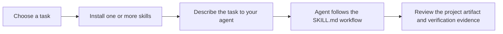
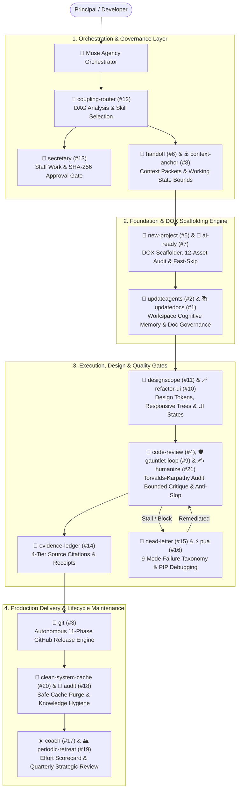

<div align="center">

# 🏛️ Muse Skills

**A curated suite of twenty-two portable agent skills for building durable projects, preserving context, coordinating reliable work, documentation synchronization & drift detection, extracting design systems, Refactoring UI design heuristics, Linus Torvalds code review, bounded gauntlet loops, staff work governance, coupling-aware routing, claim verification, reflective audits, autonomous Git release lifecycles, UI motion & animation, and repository AI-readiness auditing.**

[](https://opensource.org/licenses/MIT)
[](https://github.com/harshsinghmp/muse-skills/releases)
[](#-available-skills)
[](https://github.com/harshsinghmp)
[](#-runtime-compatibility)

</div>

---

## 🧭 Overview

Muse Skills is a public, MIT-licensed collection of agent workflows for the **LifeOS** ecosystem and compatible Markdown-based agent runtimes. Install one skill when you have a specific need, or install the complete twenty-two-skill suite with `npx skills`.

Each skill is a self-contained `SKILL.md` with structured YAML frontmatter and a repeatable workflow: when to use it, what to do, what to avoid, and how to verify the result. The suite helps agents produce work that is easier to resume, review, and hand off.

### What problem does this solve?

Agent work often loses momentum in predictable ways: a project starts without durable operating context, instructions become stale, a subagent repeats work already ruled out, or a blocked task disappears with the session. Muse Skills addresses those failure modes with small, composable workflows rather than a hosted service or a framework.

### At a glance

| You need to… | Use | Outcome |
| :--- | :--- | :--- |
| #1 Synchronize documentation & detect drift | [`updatedocs`](updatedocs/README.md) | Evidence-backed doc sync, semantic drift audit & changelog updates |
| #2 Refresh repository instructions & memory | [`updateagents`](updateagents/README.md) | Workspace-scoped cognitive memory and instruction synchronization |
| #3 Automate Git release lifecycle & anti-slop triage | [`git`](git/README.md) | 9-tier issue triage, strict 4-phase branching, doc sync, and SemVer release cuts |
| #4 Review code rigorously (Linus Torvalds Style) | [`code-review`](code-review/README.md) | 7 review modes (diff/audit/security/receive/fix…), calibrated verdict, Karpathy minimal-diff gate & test-spec immutability |
| #5 Scaffold Project OS & Progressive Disclosure DOX | [`new-project`](new-project/README.md) | Project OS foundation, 9-folder container, and framework generators |
| #6 Delegate work to subagents without losing context | [`handoff`](handoff/README.md) | Context packets, boundary-safe resumption, and an ambient HANDOFF.md live-state file for cross-conversation continuity |
| #7 Audit repository AI-readiness & zero-token fast-skip | [`ai-ready`](ai-ready/README.md) | 13-asset audit scorecard (incl. working-artifacts container), PR review mining, and Stage-0 Fast-Skip gate |
| #8 Resume focused work after an interruption | [`context-anchor`](context-anchor/README.md) | Working-reference snapshots, named client-workstream parking, and the anchor ↔ HANDOFF.md layering protocol |
| #9 Run bounded multi-round quality improvement loops | [`gauntlet-loop`](gauntlet-loop/README.md) | Bounded Builder/Critic loop with quality-bar regression gate, fail-closed eval check, security headers & visual breakpoint gates |
| #10 Refactor UI components & visual hierarchy | [`refactor-ui`](refactor-ui/README.md) | Six-mode UI engine (review/audit/improve/sweep/tokens/polish) with 11 heuristics, WCAG 2.2 AA gate, and zero-dep verification scripts |
| #11 Extract design systems & component layout trees | [`designscope`](designscope/README.md) | `design.md` brief with CSS Grid/Flexbox layout tree and DTCG token JSON |
| #12 Route task DAGs, audit skill-stack conflicts & lease shared worktrees | [`coupling-router`](coupling-router/README.md) | Plan-evaluation gate, architectural delegation routing, MVSS conflict auditor, and shared-worktree lease for multi-session checkouts |
| #13 Control staff work with Socratic adversarial gates | [`secretary`](secretary/README.md) | Socratic devil's advocate challenges, preserved dissent, SHA-256 hash seal, and delegation control (teachback + two-stage review + feedback reception) |
| #14 Track project evidence & verify factual claims | [`evidence-ledger`](evidence-ledger/README.md) | Per-project decision/commitment/claim tracking, 4-tier confidence taxonomy, staleness detection |
| #15 Preserve a failed or blocked task | [`dead-letter`](dead-letter/README.md) | 9-mode failure triage, transient/permanent recovery gate, state-verified bounded retries, root-cause cluster sweep with findings ledger, and escalation packets |
| #16 Push through a difficult debugging stall | [`pua`](pua/README.md) | Structured escalation, big-tech perf rhetoric (8 flavor packs + auto-selector), and exhaustive problem-solving |
| #17 Score daily controllable effort & focus | [`coach`](coach/README.md) | 5-pillar input scorecard and daily reflection log |
| #18 Audit link integrity & knowledge hygiene | [`audit`](audit/README.md) | 100% relative link validation, dead-reference detection, and secret sweeps |
| #19 Facilitate quarterly reviews & debt purges | [`periodic-retreat`](periodic-retreat/README.md) | Multi-scale strategic review, architecture purge, and next-Q OKRs |
| #20 Clean developer, designer & browser caches | [`clean-system-cache`](clean-system-cache/README.md) | Multi-platform cache purge, zero-session interruption & cache-only safety |
| #21 Remove AI writing patterns & polish prose | [`humanize`](humanize/README.md) | Editorial review, anti-slop pattern detection & authentic voice preservation |
| #22 Design & implement UI motion & animation | [`animate`](animate/README.md) | Library selection, canonical easing/duration, & correct code for entrances, exits, micro-interactions, scroll, page transitions |

### Explore the repository

- [Install a skill](#-quick-start)
- [Compare all skills](#-available-skills)
- [Understand the workflow](#-how-muse-skills-work)
- [Check runtime compatibility](#-runtime-compatibility)
- [Read contribution guidance](#-contributing)

---

## ⚡ Quick Start

### 1. Choose a starting point

If you are setting up a new repository, start with `new-project`. If the repository already exists and its instructions need attention, start with `updateagents`. Install a reliability skill when you are handing off work, recovering from a blocked task, or resuming after an interruption.

### 2. Install one skill

Install the skill that matches the task:

```bash
# Core Engine & Governance (#1, #2, #3, #5, #7)
npx skills add harshsinghmp/muse-skills --skill updatedocs
npx skills add harshsinghmp/muse-skills --skill updateagents
npx skills add harshsinghmp/muse-skills --skill git
npx skills add harshsinghmp/muse-skills --skill new-project
npx skills add harshsinghmp/muse-skills --skill ai-ready

# Quality & Review (#4, #9, #15, #16, #21)
npx skills add harshsinghmp/muse-skills --skill code-review
npx skills add harshsinghmp/muse-skills --skill gauntlet-loop
npx skills add harshsinghmp/muse-skills --skill dead-letter
npx skills add harshsinghmp/muse-skills --skill pua
npx skills add harshsinghmp/muse-skills --skill humanize

# Context & Orchestration (#6, #8, #12, #13, #14)
npx skills add harshsinghmp/muse-skills --skill handoff
npx skills add harshsinghmp/muse-skills --skill context-anchor
npx skills add harshsinghmp/muse-skills --skill coupling-router
npx skills add harshsinghmp/muse-skills --skill secretary
npx skills add harshsinghmp/muse-skills --skill evidence-ledger

# Design & Interface (#10, #11, #22)
npx skills add harshsinghmp/muse-skills --skill refactor-ui
npx skills add harshsinghmp/muse-skills --skill designscope
npx skills add harshsinghmp/muse-skills --skill animate

# Reflection & Maintenance (#17, #18, #19, #20)
npx skills add harshsinghmp/muse-skills --skill coach
npx skills add harshsinghmp/muse-skills --skill audit
npx skills add harshsinghmp/muse-skills --skill periodic-retreat
npx skills add harshsinghmp/muse-skills --skill clean-system-cache
```

### 3. Install a named selection

`skills.json` groups the suite into five categories and tags every skill with a `scope` — `global` (agent-level: install once, works in any workspace) or `local` (per-project). A resolver CLI turns a named selection into the concrete skill list or copy-pasteable install commands:

```bash
bun scripts/select-skills.ts list              # every named selection + category
bun scripts/select-skills.ts global            # agent-level skills (session continuity, orchestration, maintenance)
bun scripts/select-skills.ts design            # one category's skills
bun scripts/select-skills.ts minimal           # smallest useful set: updatedocs, handoff, dead-letter, secretary
bun scripts/select-skills.ts global --format install   # copy-pasteable `npx skills add` commands
bun scripts/select-skills.ts core --format json        # JSON array, for scripting
```

Named selections: `global`, `local`, `core`, `context`, `quality`, `design`, `reflect`, `minimal` — every category id and every individual skill name also resolve.

### 4. Ask your agent to use it

After installation, describe the task in plain language. The skill's frontmatter supplies the trigger language that compatible runtimes use for discovery.

```text
Before delegating this feature, use handoff to create a context packet
with the task boundaries, facts already established, and verification criteria.
```

```text
Run a 3-round gauntlet-loop on the cache refactor to verify edge cases and prevent regressions.
```

The skill writes or updates the artifact described in its documentation. Review that artifact as part of your normal project workflow.

### Install the complete suite

Install all twenty-two skills when you want the full Project OS, context, recovery, orchestration, design-extraction, UI refactoring, animation, code-review, governance, and audit toolkit:

```bash
npx skills add harshsinghmp/muse-skills
```

> **Tip:** The complete suite is also the `all` selection — `bun scripts/select-skills.ts all --format install` prints the full command list one skill at a time.

> **Tip:** You can also install a skill from its GitHub tree URL: `npx skills add https://github.com/harshsinghmp/muse-skills/tree/main/<skill-name>`.

---

## 🔁 How Muse Skills work



1. **Choose the failure mode or workflow you need to improve.** Each skill has a narrow job, so the suite stays easy to adopt incrementally.
2. **Install the skill.** `npx skills` adds the workflow to the workspace where your agent can discover it.
3. **Give the agent a concrete task.** The skill guides the process; it does not replace your project-specific requirements.
4. **Review the output.** Skills produce or update durable project artifacts such as an `AGENTS.md` file, a context packet, an anchor, or a dead-letter record.

---

## 📐 System Architecture

Muse Skills operates as an **autonomous agent execution pipeline** divided into four deterministic architectural layers: **Orchestration & Governance**, **Foundation & DOX Scaffolding**, **Execution & Hardening Gates**, and **Production Delivery & Maintenance**.

Work flows downward through strictly bounded context packets, progressive disclosure scaffolding, adversarial quality gates, and automated release lifecycles:



### Architectural Layer Breakdown

| Layer | Architectural Role | Shipped Skills | Core Governance & Invariants |
| :--- | :--- | :--- | :--- |
| **1. Orchestration & Governance** | Intake, DAG coupling analysis, staff work approval, and bounded subagent context isolation | [`coupling-router`](coupling-router/README.md) (#12)<br/>[`secretary`](secretary/README.md) (#13)<br/>[`handoff`](handoff/README.md) (#6)<br/>[`context-anchor`](context-anchor/README.md) (#8) | Socratic adversarial challenge, single-use SHA-256 hash approval gate, negative boundary constraints, sub-15-line working state snapshots. |
| **2. Foundation & DOX Engine** | Progressive disclosure scaffolding, workspace memory sync, and documentation governance | [`updatedocs`](updatedocs/README.md) (#1)<br/>[`updateagents`](updateagents/README.md) (#2)<br/>[`new-project`](new-project/README.md) (#5)<br/>[`ai-ready`](ai-ready/README.md) (#7) | 13-asset AI readiness scorecard, sub-100ms Stage-0 Fast-Skip gate, 9-folder DOX container, artifacts working-state boundary, `.memory/` no-touch boundary. |
| **3. Execution & Quality Gates** | Design system extraction, UI refactoring, adversarial code reviews, claim verification, editorial anti-slop, and failure triage | [`code-review`](code-review/README.md) (#4)<br/>[`gauntlet-loop`](gauntlet-loop/README.md) (#9)<br/>[`refactor-ui`](refactor-ui/README.md) (#10)<br/>[`designscope`](designscope/README.md) (#11)<br/>[`evidence-ledger`](evidence-ledger/README.md) (#14)<br/>[`dead-letter`](dead-letter/README.md) (#15)<br/>[`pua`](pua/README.md) (#16)<br/>[`humanize`](humanize/README.md) (#21) | Linus Torvalds & Karpathy minimal-diff doctrine, 5-state anti-slop UI gate, DTCG design tokens, 4-tier citation taxonomy, 9-mode failure classification, 4-tier PIP escalation, editorial anti-slop rules. |
| **4. Delivery & Lifecycle Maintenance** | Autonomous Git release cuts, cache cleanup, knowledge hygiene, and strategic reflection | [`git`](git/README.md) (#3)<br/>[`coach`](coach/README.md) (#17)<br/>[`audit`](audit/README.md) (#18)<br/>[`periodic-retreat`](periodic-retreat/README.md) (#19)<br/>[`clean-system-cache`](clean-system-cache/README.md) (#20) | 11-phase release pipeline, SemVer tagging, zero-runtime cache cleaner with running process guards, 5-pillar controllable effort rubric. |

---

## 📋 Available Skills

| Priority | Skill | Category | Primary Triggers | Suggested Skills | Description |
| :--- | :--- | :--- | :--- | :--- | :--- |
| **#1** | [**`updatedocs`**](updatedocs/README.md) | **Core Engine** | `update docs`, `sync documentation`, `audit docs` | `updateagents`, `git`, `ai-ready`, `audit` | Project-wide documentation synchronization, drift detection, and governance engine with strict `.memory/` and `.agents/` boundaries. |
| **#2** | [**`updateagents`**](updateagents/README.md) | **Core Engine** | `update agents.md`, `sync memory` | `updatedocs`, `new-project`, `handoff`, `context-anchor` | Auto-discover, scan, and sync agent memory files (`AGENTS.md`, `CLAUDE.md`, `.cursorrules`) in workspace root. |
| **#3** | [**`git`**](git/README.md) | **Core Engine** | `/git`, `manage git workflow`, `cut release`, `triage issues` | `code-review`, `updatedocs`, `ai-ready`, `gauntlet-loop` | Autonomous end-to-end Git & GitHub release engine: 9-tier anti-slop issue triage, strict 4-phase branching, automated doc sync, GitHub SEO tuning, and SemVer release cuts. |
| **#4** | [**`code-review`**](code-review/README.md) | **Quality & Review** | `/torvalds`, `/linus-review`, `review PR` | `git`, `gauntlet-loop`, `refactor-ui`, `pua` | Language-agnostic code review method derived from Linus Torvalds' corpus and Karpathy minimal-diff doctrine. Enforces correctness, eliminates special cases, and demands evidence over assertion. |
| **#5** | [**`new-project`**](new-project/README.md) | **Core Engine** | `/new-project`, `Agent Engine`, `DOX Engine`, `scaffold app` | `ai-ready`, `updateagents`, `updatedocs`, `git` | Progressive Disclosure DOX provisioner (AGENTS.md, 9-folder container, 12 modular standards, brand tokens, and cognitive memory). |
| **#6** | [**`handoff`**](handoff/README.md) | **Context & Orchestration** | `/handoff`, `/agent-handoff` | `context-anchor`, `coupling-router`, `dead-letter`, `updateagents`, `ai-ready` | Bidirectional handoff, resumption, and ambient continuity: context packets, state-source ladder (live file → memory → context → git forensics), an always-current HANDOFF.md so new conversations continue prior work at lowest token cost, and worktree-lease-aware dispatches for shared checkouts. |
| **#7** | [**`ai-ready`**](ai-ready/README.md) | **Core Engine** | `ai-ready`, `audit repo`, `check ai readiness` | `new-project`, `updateagents`, `git`, `updatedocs` | Comprehensive 13-asset AI-readiness audit (including the working-artifacts container rule), Stage-0 zero-token Fast-Skip Gate, and PR review convention mining. |
| **#8** | [**`context-anchor`**](context-anchor/README.md) | **Context & Orchestration** | `/anchor`, `/park`, `/switch-task` | `handoff`, `updateagents`, `dead-letter`, `audit` | Working-reference snapshots and named client-workstream parking (`/park`, `/switch-task`, `/list-anchors`) with the normative anchor ↔ HANDOFF.md layering protocol and a client-confidentiality guard. |
| **#9** | [**`gauntlet-loop`**](gauntlet-loop/README.md) | **Quality & Review** | `/gauntlet`, `/gauntlet-loop` | `code-review`, `refactor-ui`, `secretary`, `git` | Bounded multi-agent loop with security headers, multi-viewport visual audits, and plateau stop conditions. |
| **#10** | [**`refactor-ui`**](refactor-ui/README.md) | **Design & Interface** | `review this UI`, `audit UI contrast`, `refactor this component`, `make pages consistent`, `extract design tokens`, `final polish` | `designscope`, `animate`, `gauntlet-loop`, `code-review` | Six-mode UI engine (review/audit/improve/sweep/tokens/polish): 10 Refactoring UI heuristics plus modern container-query, typography, and theming techniques, a WCAG 2.2 AA blocking gate, proof-gated findings, and zero-dependency Bun verification scripts. |
| **#11** | [**`designscope`**](designscope/README.md) | **Design & Interface** | `extract the design system`, `deconstruct this layout`, `recreate this website design` | `refactor-ui`, `new-project`, `code-review` | Analyze images, websites, or Figma files into a `design.md` brief with responsive layout tree, DTCG tokens, and WCAG report. |
| **#12** | [**`coupling-router`**](coupling-router/README.md) | **Context & Orchestration** | `/router`, `/coupling`, `/worktree-lease` | `handoff`, `context-anchor`, `secretary`, `gauntlet-loop`, `updateagents` | Coupling-aware architectural router with a pre-execution plan-evaluation gate (spec alignment, verifiable acceptance criteria, DAG integrity, no completed-work overlap, evidence-backed assumptions), skill-stack compatibility auditor, and shared-worktree lease gatewith multi-perspective review for plans of 5+ tasks; enforces MVSS, routes DAGs, requires verification receipts for completion claims, and keeps two agent sessions in one checkout from colliding on branches, stashes, or shared files. |
| **#13** | [**`secretary`**](secretary/README.md) | **Context & Orchestration** | `/secretary`, `/memo` | `evidence-ledger`, `coupling-router`, `gauntlet-loop`, `code-review` | Evidence-grounded staff controller with Socratic adversarial challenge, preserved dissent, cryptographic SHA-256 seal, teachback-gated subagent dispatch with two-stage review and DAG wave dispatch, intake triage with WIP limits, blast-radius replan ladder, orient briefings, persistent task ledger, and session handover with three-tier harvest. |
| **#14** | [**`evidence-ledger`**](evidence-ledger/README.md) | **Context & Orchestration** | `/evidence`, `evidence status`, `brief me on this project` | `secretary`, `updatedocs`, `audit`, `coupling-router` | Persistent per-project evidence tracking and claim verification gate: decisions, client commitments, verified claims, and status facts with staleness detection and six `/evidence` commands. |
| **#15** | [**`dead-letter`**](dead-letter/README.md) | **Quality & Review** | `/dead-letter`, `/dl`, `dead-letter status` | `handoff`, `pua`, `context-anchor`, `secretary` | Capture failed/blocked agent tasks into structured failure records with a transient/permanent recovery gate, precondition-checked bounded retries against a last-known-good baseline, ordered recovery sequence, close-out repro test packs for deterministic failures, root-cause cluster triage across open records, orphaned-resource cleanup, and actionable escalations. |
| **#16** | [**`pua`**](pua/README.md) | **Quality & Review** | `PIP`, `/pua`, `try harder`, `figure it out` | `dead-letter`, `code-review`, `gauntlet-loop` | Put your AI on a Performance Improvement Plan. Forces exhaustive problem-solving with big-tech perf rhetoric. |
| **#17** | [**`coach`**](coach/README.md) | **Reflection & Maintenance** | `/standup`, `/daily` | `audit`, `periodic-retreat`, `context-anchor` | Daily reflective check-in and 5-pillar controllable input effort scorecard (TDD, minimal diffs, hygiene, focus, triage). |
| **#18** | [**`audit`**](audit/README.md) | **Reflection & Maintenance** | `/audit-brain`, `/hygiene` | `updatedocs`, `updateagents`, `evidence-ledger`, `dead-letter`, `ai-ready`, `coach`, `periodic-retreat` | Knowledge hygiene and referential integrity auditor with severity-routed remediation (auto-repair / propose-diff / report-only / defer-route), per-step progress reporting, re-verification delta, and companion-skill routing. |
| **#19** | [**`periodic-retreat`**](periodic-retreat/README.md) | **Reflection & Maintenance** | `/retreat`, `/quarterly` | `coach`, `audit`, `updateagents`, `updatedocs` | Quarterly personal and project strategic retreat facilitator for architecture debt purges, TELOS alignment, and next-Q OKRs. |
| **#20** | [**`clean-system-cache`**](clean-system-cache/README.md) | **Reflection & Maintenance** | `/clean-cache`, `/purge-cache` | `audit`, `periodic-retreat`, `code-review` | Cross-platform developer, designer, and browser cache cleaner across Windows, Linux, and macOS with active session protection and zero-session interruption. |
| **#22** | [**`animate`**](animate/README.md) | **Design & Interface** | `animate this`, `add motion`, `framer motion`, `scroll animation`, `page transition` | `refactor-ui`, `designscope`, `code-review`, `gauntlet-loop` | Web UI animation and motion: library selection, canonical easing/duration tables, and segregated per-domain references (Motion, CSS, WAAPI, GSAP, native mobile) with reduced-motion and performance defaults. Five modes (build/review/improve/audit/find). |

---

## 🔍 Detailed Skill Breakdown

<details>
<summary><b>📖 Click to expand Detailed Skill Breakdown (all 22 skills)</b></summary>
<br/>

### 🚀 `new-project` (Flagship #1 — Agent Engine / DOX Engine)

Interactive project creator, DOX Engine, and Agent Engine provisioner. Implements the **"Agents First, Then Project Type"** two-stage architecture: provisions the lean root `AGENTS.md`, `.gitignore`, complete 9-folder `.agents/` container (12 modular standards, brand tokens, and cognitive memory) before launching interactive framework creators (Astro, Next.js, Instatic, Hono, Vite).

```bash
npx skills add harshsinghmp/muse-skills --skill new-project
```

- **Path Auto-Discovery**: Scans local workspace projects directory and suggests immediate target locations.
- **Framework Archetypes**: Next.js 16 (App Router + Tailwind v4 + React 19), Astro (Static/SSR), Vite + React, Node/Bun API, WordPress/PHP.
- **Project OS Assets**: Generates `.agentrules`, `AGENTS.md` (Muse Council hierarchy), `CLAUDE.md`, `STATE.md` (8-stage reality machine), `llms.txt` bundler, and hardened `.gitignore`.
- **Pre-configured Presets**: `agency-suite` (28 design & taste skills), `design`, `fullstack`, `growth`, `all`, `none`.

[Read full documentation →](new-project/README.md)

---

### 🧠 `updateagents` (Flagship #2)

Automatically discovers, reads, and updates agent memory files (`AGENTS.md`, `CLAUDE.md`, `.cursorrules`, etc.) in the current working directory.

```bash
npx skills add harshsinghmp/muse-skills --skill updateagents
```

- **Workspace-Scoped Discovery**: Scans current repository root only; never traverses parent paths.
- **Ecosystem Integration**: Reads output from `cavemem`, `codegraph`, `rtk`, `memoryagent`, and `ponytail`.
- **Intelligent Synthesis**: Extracts essential build/test commands, architecture flows, conventions, and non-obvious gotchas.
- **Safe Incremental Updates**: Preserves user-written rules and architectural decisions while refreshing stale documentation.

[Read full documentation →](updateagents/README.md)

---

### 🛡️ `pua` (PIP Performance Improvement Plan)

Put your AI on a Performance Improvement Plan. Forces exhaustive problem-solving with Western big-tech performance culture rhetoric and structured debugging.

```bash
npx skills add harshsinghmp/muse-skills --skill pua
```

- **Three Non-Negotiables**: Exhaust all options (*Bias for Action*), Act before asking (*Dive Deep*), and Take the initiative (*Ownership*).
- **4-Tier Pressure Escalation**: L1 Verbal Warning ➔ L2 Written Feedback ➔ L3 Formal PIP ➔ L4 Final Review.
- **Universal 5-Step Methodology**: Pattern Recognition ➔ Elevate ➔ Self-Review ➔ Execute ➔ Retrospective.
- **Mandatory 7-Point Checklist**: Word-by-word error analysis, proactive search, 50-line raw context, inverted assumptions, and minimal reproductions.
- **8 Big-Tech Flavor Packs**: Amazon Leadership Principles, Google Calibration, Meta Move Fast, Netflix Keeper Test, Musk Hardcore, Jobs A-Player, Stripe Craft, and Competitive Horse Race.

[Read full documentation →](pua/README.md)

---

### 🤝 `handoff` (Priority #6 — Context & Orchestration)

Generate a structured context packet before dispatching any subagent. Prevents context drift, hallucinated constraints, and re-exploring dead ends.

```bash
npx skills add harshsinghmp/muse-skills --skill handoff
```

- **Explicit Working Model**: Externalizes orchestrator facts, ruled-out failed paths, and exact line ranges.
- **Hard Negative Boundaries**: Codifies `MUST NOT` constraints that propagate cleanly to subagent prompts.
- **Deterministic Verification**: Establishes unambiguous success criteria before work begins.
- **Persistence**: Writes a timestamped handoff record to the configured agent-context location (the current default is `.claude/handoff-<timestamp>.md`).

[Read full documentation →](handoff/README.md)

---

### 📮 `dead-letter`

Capture failed or blocked tasks before context clears. Categorizes failure modes into a 9-part taxonomy, distinguishes transient from permanent failures, verifies actual state before any retry, and generates either a bounded autonomous retry prompt or an escalation decision point.

```bash
npx skills add harshsinghmp/muse-skills --skill dead-letter
```

- **9-Code Failure Taxonomy**: `BLOCKED-CRED`, `BLOCKED-PERM`, `BLOCKED-DATA`, `BLOCKED-AMBIG`, `BLOCKED-RATE`, `FAILED-LOGIC`, `FAILED-TOOL`, `FAILED-SCOPE`, and `PARTIAL`.
- **Recovery Decision Gate**: seen-before count, transient/permanent classification, and an autonomy level (`auto` / `confirm` / `escalate`) — permanent failures never get retry packets, and a third occurrence of the same root cause always escalates.
- **State Verification Before Retry**: every retry packet carries a precondition check so a mid-backoff or half-applied state is never retried blindly; verification runs in bounded fix-poll rounds (max 3) before escalating.
- **Preserves Partial Output & Orphans**: Guarantees partial file writes are not lost and orphaned PRs, branches, processes, and temp files are enumerated with cleanup commands.
- **Actionable Escalations**: Generates specific decision questions routed to Council agents (`NEXUS`, `SOL`, `JASPER`, `CREW`).

[Read full documentation →](dead-letter/README.md)

---

### ⚓ `context-anchor`

Drop a compact working reference snapshot in the project’s configured agent-context location (the current default is `<project-root>/.agents/anchor.md`) to prevent cascading context drift across long sessions, breaks, or task switches.

```bash
npx skills add harshsinghmp/muse-skills --skill context-anchor
```

- **Zero-Filler State**: Captures active state, key architectural decisions with "why" rationale, and ruled-out paths in under 15 lines.
- **Atomic Next Step**: Defines the single concrete next action with exact file and line references.
- **Drift Elimination**: Prevents models from hallucinating against stale context after long conversations.

[Read full documentation →](context-anchor/README.md)

---

### 🎨 `designscope`

Point at any visual source — a screenshot, a live website, or a Figma file — and extract its structured design system and responsive component layout tree into artifacts another AI (or human) can build from.

```bash
npx skills add harshsinghmp/muse-skills --skill designscope
```

- **Three Source Flows**: local images (direct vision), website URLs (web fetch + CSS variable extraction + native browser screenshots), and Figma links (Figma MCP tools).
- **Two Modes**: full analysis (`design.md` + DTCG `design-tokens.json` + optional WCAG report) and element mode (one component → rebuild spec or token-grounded image prompt).
- **Layout Tree Extraction**: deconstructs visual UI screenshots into container blocks (Header, Hero, Feature Grid, Bento Cards, Footer), generating responsive CSS Grid and Flexbox component hierarchies.
- **Six-Layer Analysis**: identity, system tokens, components, layout & layout trees, reconstruction notes, and brand Do's/Don'ts — plus a non-negotiable Art Direction QA pass.
- **Honesty Contract**: confidence markers on every inference, real hex codes only, mandatory Open Questions section.
- **Lint Gate**: every deliverable passes `scripts/lint_design_md.py` before handoff; all scripts are Python stdlib-only.

[Read full documentation →](designscope/README.md)

---

### 🪄 `refactor-ui`

Systematically evaluate, refine, and refactor user interface components, layouts, and design systems using the 10 atomic heuristics of Wathan & Schoger (*Refactoring UI*) plus a modern-techniques layer distilled from a 127-source agent-skill corpus.

```bash
npx skills add harshsinghmp/muse-skills --skill refactor-ui
```

- **Six Execution Modes**: `review` (verdict table, default), `audit` (scripted scan + scored report), `improve` (5-step refactor), `sweep` (multi-page consistency matrix), `tokens` (extract-and-centralize), and `polish` (launch triage) — each a scoped contract in `references/modes.md`.
- **Modern Techniques**: Concentric radius law, 2× grouping ratio, container-query doctrine, 60–75ch measure with role-based line-heights, named z-scale tokens, surface ladder, and light/dark theme parity (`references/modern-techniques.md`).
- **WCAG 2.2 AA Blocking Gate**: Contrast failures block completion; scripts produce pasted receipts.
- **Proof-Gated Findings**: Candidates need contract + runtime + correction evidence; unrun checks are reported `Not verified`.
- **Zero-Dependency Tooling**: `check-contrast.ts` (AA/AAA + large-text/UI thresholds) and `audit-ui.ts` (anti-pattern scanner incl. raw z-index and missing focus alternatives) — CI-ready exit codes.

[Read full documentation →](refactor-ui/README.md)

---

### 🐧 `code-review` (Priority #4 — Quality & Review)

A language-agnostic code review method derived from Linus Torvalds' 30+ year review corpus. Enforces absolute correctness, eliminates special cases through clean data structures, and demands empirical evidence over assertion.

```bash
npx skills add harshsinghmp/muse-skills --skill code-review
```

- **Data Structures First**: Identifies and fixes bad data models where conditional logic and special cases proliferate.
- **15-Theme Trigger Catalog**: Audits Level 1 Global Invariants (API stability, memory safety, concurrency, security check placement), Level 2 Structural Patterns, and Level 3 Tactical Guidelines.
- **Precedence Chain**: Strictly enforces $\text{Correctness} > \text{Performance} > \text{Complexity} > \text{Style}$.
- **Severity Calibration**: Calibrated against a 38,303 public decision baseline ($42.2\%$ Request Changes, $23.8\%$ Reject).
- **[REASON] $\rightarrow$ [ACT] Protocol**: Eliminates false positives by verifying surrounding context, articulating the underlying design invariant, and providing concrete replacement diffs.

[Read full documentation →](code-review/README.md)

---

### 🛡️ `gauntlet-loop`

Bounded multi-agent quality improvement loop that eliminates infinite token burns, self-grading delusions, and regression churn. Deploys an unyielding, 4-role protocol (Freeze → Build → Fresh Critic → Automated Gate → Integrator).

```bash
npx skills add harshsinghmp/muse-skills --skill gauntlet-loop
```

- **4-Role Isolation**: Builder proposes diffs; isolated Fresh Critic scores 0–10; Automated Gate runs tests; Integrator merges only the #1 highest-impact fix.
- **Web Security & Visual Regression Gate**: Automated Gate verifies OWASP security headers (CSP, HSTS, X-Frame-Options) and audits 375px/768px/1280px viewports for zero horizontal overflow.
- **Mathematical Stop Conditions**: Terminates on Proof of Passing ($\ge 9.0/10$), Score Plateau (2 rounds without gain), Regression ($>1.0$ drop), or Budget exhaustion.
- **Artifact Trail**: Outputs `GAUNTLET_JOB_CONTRACT.md`, `ITERATION_LEDGER.md`, and `ACCEPTANCE_PACKET.md`.

[Read full documentation →](gauntlet-loop/README.md)

---

### 📑 `secretary` (Priority #13 — Context & Orchestration)

Evidence-grounded staff-work controller and approval gate for high-stakes decisions, executive briefs, memos, and outbound actions — extended with delegation control: teachback-gated subagent dispatch, two-stage review, intake triage, blast-radius replan, and structured session handover.

```bash
npx skills add harshsinghmp/muse-skills --skill secretary
```

- **Socratic Adversarial Gate**: Enforces a 3-prong devil's advocate stress-test (Architectural Fragility, Rollback Burden, Hidden Assumptions) before computing payload hashes.
- **Judgment, Not Authority**: Recommends with rigor; stops dead at `NEEDS_APPROVAL` for any filesystem write or external mutation.
- **Dissent Preservation**: Explicitly highlights contradictions, uncertainties, and `[NO-DATA]` gaps in the formal Dissent Ledger.
- **Single-Use Hash Gate**: Computes SHA-256 fingerprint of proposed payload; requires exact user confirmation token before execution.
- **Delegation Control Gates**: Dispatched subagents confirm a teachback (restated scope, acceptance criteria, dependencies) before starting work; deliveries pass two reviewer stages (spec-compliance + quality) with a 3-retry fix cycle before escalation.
- **Intake Triage & Replan**: Raw input is classified before action with WIP limits and mandatory `done_when`/`next_action`; invalidated plans are re-scoped through a blast-radius ladder (NEXT_ACTION → MILESTONE → OUTCOME → KILL) and logged.
- **Session Handover**: Structured state plus unstructured temperature notes survive context resets via `.agents/secretary-handover.md`; on-entry briefings give a read-only orient view with one recommendation.

[Read full documentation →](secretary/README.md)

---

### 🔀 `coupling-router`

Coupling-aware architectural delegation and skill-stack compatibility router. Evaluates the routing plan against a pre-execution gate, then analyzes task dependency graphs, shared mutable state, type definitions, and active skill interactions to deterministically route tasks.

```bash
npx skills add harshsinghmp/muse-skills --skill coupling-router
```

- **Plan-Evaluation Gate**: five pre-execution checks — spec alignment (primary verdict), verifiable acceptance criteria, DAG integrity, scope overlap with completed work, evidence-backed assumptions — a failing plan is reworked, not dispatched with caveats.
- **Skill-Stack & Token Conflict Auditor**: Audits active skills against the Skill Compatibility Matrix, silences conflicting instructions, and enforces the Minimal Viable Skill Set (MVSS $\le$ 6,000 tokens).
- **High Coupling Routing**: Routes interdependent tasks (shared types, database schemas, rendering pipeline) to a single sequential builder.
- **Low Coupling Fan-Out**: Dispatches truly orthogonal tasks (isolated test suites, independent docs, separate microservices) to parallel subagents.
- **DAG & Allocation Generation**: Outputs `ROUTING_PLAN.md` with active MVSS, suppressed skills, Mermaid dependency graph, and file isolation boundaries; every completion claim carries a verification receipt — claims without receipts reopen the task.
- **Shared-Worktree Lease (`/worktree-lease`)**: Probes, acquires, and releases `.agents/artifacts/WORKTREE-LEASE.md` so two agent sessions in one checkout never collide on branches, stashes, or shared files — with a takeover rule for stale heartbeats and a repair ladder for collisions that slip through.

[Read full documentation →](coupling-router/README.md)

---

### 📜 `evidence-ledger`

Persistent per-project evidence tracking system and source-cited claim verification gate for multi-client agency workflows. Maintains an append-only `evidence-ledger.md` per project — decisions, client commitments, verified claims, and status facts — all backed by receipts. Enforces the strict doctrine: *"No source, no claim. No verification path, no release."*

```bash
npx skills add harshsinghmp/muse-skills --skill evidence-ledger
```

- **Six Commands**: `/evidence onboard` (mine context files into a starter ledger), `/evidence status` (dashboard + health score + staleness sweep), `/evidence decide` (decision records with alternatives and evidence trail), `/evidence commit` (client commitments with deadlines and delivery proof), `/evidence audit` (claim verification gate → `claim-ledger.md` + `MISSING_RECEIPTS_REPORT.md`), `/evidence brief` (context-switch briefing).
- **4-Tier Confidence Taxonomy**: `[RAW]` (local test output), `[FETCH]` (primary URL / DOI), `[SEARCH]` (corroborated search), `[INFER]` (declared logical deduction) — with `[EMPIRICAL]` vs `[SPECULATIVE]` demarcation.
- **Status Lifecycle**: append-only entries move through `ACTIVE`/`VERIFIED`/`FULFILLED`/`PROMISED`/`OVERDUE`/`STALE`/`SUPERSEDED`/`QUARANTINED`/`REDACTED` — never deleted, always auditable.
- **Staleness Detection**: overdue commitments, claims unverified >30 days, and blockers >14 days auto-flag on every dashboard regeneration.
- **Agency Orchestration**: context-anchor parks workstreams before briefs/audits; secretary gates high-stakes decisions; dead-letter triages quarantined claims; handoff dispatches the briefing to subagents.

[Read full documentation →](evidence-ledger/README.md)

---

### ☀️ `coach` (Priority #17 — Reflection & Maintenance)

Daily reflective check-in and effort scorecard for developers and AI agents. Evaluates controllable inputs rather than fluctuating external outcomes.

```bash
npx skills add harshsinghmp/muse-skills --skill coach
```

- **5 Controllable Input Pillars**: TDD compliance, minimal diff discipline, security/secret hygiene, deep work focus, and blocked-task triage.
- **Stoic Effort Rubric**: Generates an honest 1–10 effort score evaluating execution rigor.
- **MIT Planning**: Establishes exactly one Most Important Task and up to 2 secondary goals for the next work cycle.

[Read full documentation →](coach/README.md)

---

### 🏔️ `periodic-retreat`

Quarterly personal and project strategic retreat facilitator. Conducts multi-scale deep audits of project health, architecture debt, deprecated system purges, and next-quarter OKRs.

```bash
npx skills add harshsinghmp/muse-skills --skill periodic-retreat
```

- **4-Phase Framework**: Retrospective Audit ➔ Architecture Debt Purge ➔ TELOS Alignment ➔ Next-Quarter OKR Formulation.
- **Debt Purge Register**: Systematically sunsetting zombie repos, dead configs, unmaintained dependencies, and outdated documentation.
- **High-Leverage OKRs**: Formulates 3 core objectives with binary, measurable Key Results.

[Read full documentation →](periodic-retreat/README.md)

---

### 🧠 `audit` (Priority #18 — Reflection & Maintenance)

Knowledge hygiene and referential integrity auditor for AI agent memory banks, documentation trees, and knowledge bases.

```bash
npx skills add harshsinghmp/muse-skills --skill audit
```

- **100% Relative Link Integrity**: Detects dead markdown links, broken symbol anchors, and moved file paths.
- **Secret Sweeps**: Audits markdown documentation to guarantee zero leaked tokens (`sk-*`, `ghp_*`, private keys).
- **Referential Hygiene**: Flags orphaned memory files and stale contradictory documentation before agents hallucinate.

[Read full documentation →](audit/README.md)

---

### 🐙 `git`

Autonomous end-to-end Git and GitHub release lifecycle engine with 9-tier anti-slop issue triage, strict 4-phase branching, automated doc sync, GitHub SEO tuning, and SemVer release cuts.

```bash
npx skills add harshsinghmp/muse-skills --skill git
```

- **9-Tier Anti-Slop Triage**: Categorizes issues before writing code to prevent hallucinated changes and low-signal churn.
- **Strict Branch Governance**: Never commits directly to `master`; routes work from `dev` through `release/vX.Y.Z` cuts and back-merges.
- **GitHub SEO & Presentation Pass**: Automatically synchronizes repository topics, description, and Open Graph previews.
- **Automated Doc & Changelog Sync**: Invokes `updatedocs` and stamps `CHANGELOG.md` unreleased entries prior to opening PRs.

[Read full documentation →](git/README.md)

---

### 🤖 `ai-ready`

Comprehensive repository AI-readiness auditor and scaffolding engine. Audits 12 tracked assets across AI Context, Dev Workflow, and Onboarding with a 4-tier grading matrix (Getting Started to AI-Ready), zero-token Stage-0 Fast-Skip Gate, and merged PR review convention mining.

```bash
npx skills add harshsinghmp/muse-skills --skill ai-ready
```

- **12-Asset AI Audit**: Tracks essential AI context, developer workflows, and onboarding hygiene without boilerplate fluff.
- **Stage-0 Fast-Skip Gate**: Exits immediately in `<100ms` with zero token burn when the repository is already verified compliant.
- **PR Review Mining**: Mines recent merged PR reviews via GitHub CLI to turn recurring reviewer feedback into explicit agent instructions.
- **Targeted Surgical Remediation**: Scaffolds only missing assets without clobbering existing developer configurations.

[Read full documentation →](ai-ready/README.md)

---

### 🧹 `clean-system-cache`

Cross-platform development and design cache cleanup engine for Linux, macOS, and Windows. Cleans unused package managers (npm, bun, yarn, pnpm, cargo, pip/uv, gradle), build tools, design applications (Figma, Adobe, Blender), and browser caches while strictly protecting running processes, active user sessions, and persistent credentials.

```bash
npx skills add harshsinghmp/muse-skills --skill clean-system-cache
```

- **Cross-Platform Zero-Python Architecture**: Pure Bash on Linux/macOS and pure Batch/CMD on Windows (`scripts/clean-cache.sh` and `scripts/clean-cache.cmd`).
- **Running Session Protection**: Dynamically detects running instances of tools and browsers (Chrome, Firefox, Figma, Docker, etc.) and safely skips active application caches to prevent session corruption.
- **Cache-Only Isolation**: Strictly targets temporary cache stores (`Cache/`, `Code Cache/`, `GPUCache/`, `~/.cache`), preserving user cookies, saved sessions, profiles, and download histories.
- **Dry-Run & Targeted Scopes**: Supports `--dry-run` safe estimation and targeted tool flags (`--browsers-only`, `--dev-only`, `--design-only`).

[Read full documentation →](clean-system-cache/README.md)

---

### ✍️ `humanize`

Editorial review and prose humanization system that detects and eliminates AI-generated writing artifacts, formulaic patterns, significance inflation, and robotic cadence without altering facts, claims, or the author's authentic voice.

```bash
npx skills add harshsinghmp/muse-skills --skill humanize
```

- **Editorial System, Not Evasion**: Treats AI-style signals as evidence to inspect rather than mechanical rules to obey blindly.
- **6 Operating Modes**: Supports Edit (surgical minimal diff), Rewrite (full reconstruction), Detect (structured audit table), File (in-place markdown/code preserving), Repo Audit, and Embedded.
- **Strict Hierarchy of Truth**: Prioritizes Accuracy > Meaning > Voice > Register > Specificity > Clarity > Density > Rhythm > Polish. Never hallucinates metrics or invents anecdotes.
- **30+ Anti-Slop Patterns**: Pinpoints significance inflation, shallow participles, copula avoidance, binary contrasts, and forced triads with concrete before/after fixes.

[Read full documentation →](humanize/README.md)

---

### 🎬 `animate` (Priority #22 — Design & Interface)

Design and implement web UI animation and motion that survives strict design-engineering review on the first pass.

```bash
npx skills add harshsinghmp/muse-skills --skill animate
```

- **Library router**: walks a "cheapest tool that fits" ladder — CSS transition → `@starting-style` → CSS animation → WAAPI → Motion (`motion.dev`) — with GSAP and native mobile gated behind an explicit ask.
- **Canonical easing & duration**: strong cubic-bezier tokens (`--ease-out: cubic-bezier(0.23,1,0.32,1)`) and sub-300ms UI budgets, grounded in the Emil Kowalski design-engineering bar.
- **Segregated references**: nine per-domain files (principles, motion-dev, css, performance, accessibility, review, gsap, mobile, other-libraries) loaded on demand to keep token cost low.
- **Ships reduced-motion + pointer gating** with every animation, and a frequency gate that correctly returns *"no animation"* for keyboard/100×-daily actions.
- **Five modes**: build (default) / review / improve / audit / find — routed on the verb; only build edits code.

[Read full documentation →](animate/README.md)

</details>

---

## 🌐 Runtime compatibility

Muse Skills uses portable Markdown workflows with YAML frontmatter. Compatibility depends on each runtime’s skill-discovery and installation model; the table below describes the intended integration path rather than a claim that every runtime behaves identically.

| Agent Platform | Compatibility | Ingestion Mechanism |
|:---|:---:|:---|
| **`npx skills` CLI** | Native | Installs skills and resolves their repository structure |
| **Claude Code & Desktop** | Markdown workflow | Reads structured Markdown and YAML frontmatter |
| **Hermes** | Metadata-aware | Reads `metadata.hermes`, tool dependencies, and platform constraints |
| **OpenAI Codex & Cursor** | Markdown workflow | Uses agent prompt schemas and workspace instruction files |
| **Gemini CLI & Antigravity** | Markdown workflow | Uses agent tools, system prompts, and subagent dispatch conventions |
| **OpenCode & Pi** | Markdown workflow | Reads portable Markdown skill instructions |

For the authoring contract that keeps these workflows portable, see the [Skill Authoring Specification](docs/SKILL_SPECIFICATION.md).

---

## 📁 Repository Structure

<details>
<summary><b>📂 Click to expand Complete Repository Directory Tree</b></summary>
<br/>

```text
muse-skills/
├── new-project/                    # Project OS & governance scaffolder (Flagship #1)
│   ├── agents/
│   │   └── openai.yaml             # Agent tool definition
│   ├── references/
│   │   └── project-os-architecture.md
│   ├── scripts/
│   │   └── new-project.ts          # Scaffolder engine
│   ├── README.md
│   └── SKILL.md
│
├── updateagents/                   # Memory & context synchronization (Flagship #2)
│   ├── agents/
│   │   └── openai.yaml
│   ├── examples/
│   │   └── before-after.md
│   ├── references/
│   │   ├── discovery-commands.md
│   │   └── memory-file-priorities.md
│   ├── scripts/
│   │   └── validate-memory-file.sh # Memory file validator
│   ├── README.md
│   └── SKILL.md
│
├── updatedocs/                     # Documentation synchronization & drift detection
│   ├── agents/
│   │   └── openai.yaml
│   ├── examples/
│   │   └── sample-sync-report.md   # Full & condensed sync report examples
│   ├── references/                 # 8 policy & matrix reference guides
│   ├── README.md
│   └── SKILL.md
│
├── pua/                            # PIP performance & structured debugging
│   ├── agents/
│   │   └── openai.yaml
│   ├── examples/
│   │   └── sample-pip-report.md
│   ├── README.md
│   └── SKILL.md
│
├── handoff/                        # Handoff, resumption & ambient continuity engine
│   ├── agents/
│   │   └── openai.yaml
│   ├── examples/
│   │   ├── sample-HANDOFF.md
│   │   └── sample-handoff.md
│   ├── references/
│   │   ├── ambient-handoff.md
│   │   └── resumption-protocol.md
│   ├── README.md
│   └── SKILL.md
│
├── context-anchor/                 # Working references & workstream parking
│   ├── agents/
│   │   └── openai.yaml
│   ├── examples/
│   │   ├── sample-anchor.md
│   │   └── sample-workstream-anchor.md
│   ├── references/
│   │   └── layering-protocol.md
│   ├── README.md
│   └── SKILL.md
│
├── dead-letter/                    # Failed/blocked task triage & capture
│   ├── agents/
│   │   └── openai.yaml
│   ├── examples/
│   │   ├── sample-dead-letter.md
│   │   └── sample-repro-pack.md
│   ├── README.md
│   └── SKILL.md
│
├── designscope/                    # Design system & component layout tree extraction
│   ├── agents/
│   │   └── openai.yaml
│   ├── references/                 # Capture flows, analysis framework, layout tree, token extraction, templates
│   ├── scripts/                    # Stdlib-only Python helpers (CSS vars, contrast, lint, verify)
│   ├── LICENSE                     # MIT (upstream-attribution copy)
│   ├── README.md
│   └── SKILL.md
│
├── refactor-ui/                    # Atomic UI design & interface refactoring engine (6 modes)
│   ├── agents/
│   │   └── openai.yaml             # Agent tool definition
│   ├── examples/                   # Worked audit-mode report sample
│   ├── references/                 # 11 heuristic guides + modes.md + modern-techniques.md
│   ├── scripts/                    # audit-ui.ts scanner & check-contrast.ts (zero-dep Bun)
│   ├── LICENSE                     # MIT (with Refactoring UI attribution)
│   ├── README.md
│   └── SKILL.md
│
├── code-review/                    # Rigorous code review (Linus Torvalds & Karpathy)
│   ├── agents/
│   │   └── openai.yaml             # Agent tool definition
│   ├── examples/
│   │   └── sample-review.md        # Concrete review verdict example
│   ├── README.md
│   └── SKILL.md
│
├── gauntlet-loop/                  # Bounded multi-agent quality & web security loop
│   ├── agents/
│   │   └── openai.yaml
│   ├── examples/
│   │   └── sample-gauntlet-run.md
│   ├── references/
│   │   ├── gauntlet-protocol.md
│   │   └── web-security-visual-gate.md
│   ├── README.md
│   └── SKILL.md
│
├── secretary/                      # Evidence-grounded staff controller & Socratic gate
│   ├── agents/
│   │   └── openai.yaml
│   ├── examples/
│   │   └── sample-approval-packet.md
│   ├── references/
│   │   ├── socratic-adversarial-gate.md
│   │   └── staff-work-doctrine.md
│   ├── README.md
│   └── SKILL.md
│
├── coupling-router/                # Coupling-aware architectural delegation & skill-stack router
│   ├── agents/
│   │   └── openai.yaml
│   ├── examples/
│   │   └── sample-routing-decision.md
│   ├── references/
│   │   ├── coupling-matrix.md
│   │   ├── skill-compatibility-matrix.md
│   │   └── worktree-lease-protocol.md
│   ├── scripts/
│   │   └── worktree-lease.ts       # One-command lease gate (probe/hold/release)
│   ├── README.md
│   └── SKILL.md
│
├── evidence-ledger/                # Persistent project evidence tracking & claim verification gate
│   ├── agents/
│   │   └── openai.yaml
│   ├── examples/
│   │   ├── sample-claim-ledger.md
│   │   ├── sample-evidence-brief.md
│   │   └── sample-evidence-ledger.md
│   ├── references/
│   │   ├── academic-citation-protocol.md
│   │   ├── claim-verification-taxonomy.md
│   │   ├── evidence-entry-schema.md
│   │   ├── skill-orchestration.md
│   │   └── staleness-rules.md
│   ├── README.md
│   └── SKILL.md
│
├── coach/                          # Daily reflective check-in & effort scorecard
│   ├── agents/
│   │   └── openai.yaml
│   ├── examples/
│   │   └── sample-standup-log.md
│   ├── references/
│   │   └── effort-rubric.md
│   ├── README.md
│   └── SKILL.md
│
├── periodic-retreat/               # Quarterly strategic retreat facilitator
│   ├── agents/
│   │   └── openai.yaml
│   ├── examples/
│   │   └── sample-quarterly-review.md
│   ├── references/
│   │   └── retreat-framework.md
│   ├── README.md
│   └── SKILL.md
│
├── audit/                          # Knowledge hygiene & referential integrity auditor
│   ├── agents/
│   │   └── openai.yaml
│   ├── examples/
│   │   └── sample-audit-report.md
│   ├── references/
│   │   ├── hygiene-rules.md
│   │   └── remediation-matrix.md
│   ├── README.md
│   └── SKILL.md
│
├── git/                            # Autonomous release & GitHub lifecycle engine
│   ├── agents/
│   │   └── openai.yaml
│   ├── references/
│   │   ├── anti-slop-triage.md
│   │   ├── branching-and-release-matrix.md
│   │   └── github-seo-and-presentation.md
│   ├── README.md
│   └── SKILL.md
│
├── ai-ready/                       # Repository AI-readiness auditor & scaffolding engine
│   ├── agents/
│   │   └── openai.yaml
│   ├── references/
│   │   ├── fast-skip-protocol.md
│   │   ├── pr-review-mining.md
│   │   └── twelve-asset-matrix.md
│   ├── templates/
│   │   ├── github/
│   │   │   ├── ISSUE_TEMPLATE/
│   │   │   │   ├── bug_report.md
│   │   │   │   └── feature_request.md
│   │   │   ├── dependabot.yml
│   │   │   └── pull_request_template.md
│   │   ├── llms.txt
│   │   ├── mcp.json.template
│   │   ├── AGENTS.md
│   │   ├── env.example
│   │   └── gitignore.template
│   ├── scripts/
│   │   └── ai-ready.ts
│   ├── README.md
│   └── SKILL.md
│
├── clean-system-cache/             # Cross-platform development & design cache cleaner
│   ├── agents/
│   │   └── openai.yaml
│   ├── scripts/
│   │   ├── clean-cache.cmd
│   │   └── clean-cache.sh
│   ├── README.md
│   └── SKILL.md
│
├── humanize/                       # Editorial review & prose humanization engine
│   ├── agents/
│   │   └── openai.yaml
│   ├── references/
│   │   ├── patterns.md
│   │   ├── style-guide.md
│   │   └── verification.md
│   ├── README.md
│   └── SKILL.md
│
├── animate/                        # Web UI motion & animation router (5 modes)
│   ├── agents/
│   │   └── openai.yaml
│   ├── examples/
│   │   └── micro-interaction.md
│   ├── references/                 # 9 per-domain guides (principles, motion-dev, css, performance, a11y, review, gsap, mobile, other)
│   ├── README.md
│   └── SKILL.md
│
├── .agents/
│   └── context/                     # Durable agent context pack (index, product, architecture, ...)
│
├── AGENTS.md                        # Agent working rules & context routing
├── CONTRIBUTING.md                  # Contribution guidelines
├── docs/                             # Architecture, changelog, and skill-authoring specification
├── SECURITY.md                      # Private vulnerability reporting
├── LICENSE                         # MIT License
├── llms.txt                         # LLM-facing repository index
├── package.json                    # Package metadata & keywords
├── README.md                       # Comprehensive repository documentation
├── skills.json                     # Skill registry catalog
└── tests/                          # Automated TDD test suite
    └── skills.test.ts
```

</details>

---

## 📚 Documentation and support

- [Skill Authoring Specification](docs/SKILL_SPECIFICATION.md) explains the required shape of a skill and its frontmatter.
- [Architecture](docs/ARCHITECTURE.md) describes the repository’s design and packaging model.
- [Changelog](docs/CHANGELOG.md) records released changes.
- [Dogfooding Runbook](docs/DOGFOOD.md) validates the suite on real foreign projects (continuity, parking, evidence, lease).
- [Contributing](CONTRIBUTING.md) explains how to propose improvements.
- [Security policy](SECURITY.md) explains how to report vulnerabilities privately.

Muse Skills is static documentation plus small, optional helper scripts—there is no hosted account, service, or daemon to configure.

---

## 📜 Contributing

Read [CONTRIBUTING.md](CONTRIBUTING.md) before opening a pull request. Report vulnerabilities privately through [SECURITY.md](SECURITY.md), not a public issue.

---

## 📄 License

[MIT](LICENSE) © [Harsh](https://github.com/harshsinghmp)

---

<div align="center">

<a href="https://star-history.com/#harshsinghmp/muse-skills&Date"></a>

</div>
