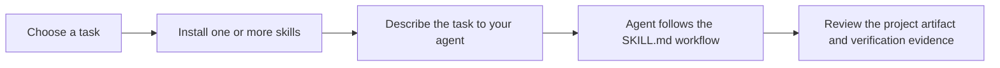
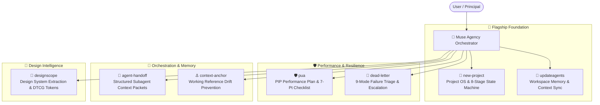

<div align="center">

# 🏛️ Muse Skills

**A curated suite of seven portable agent skills for building durable projects, preserving context, coordinating reliable work, and extracting design systems.**

[](https://opensource.org/licenses/MIT)
[](https://github.com/harshsinghmp/muse-skills/releases)
[](#-available-skills)
[](https://github.com/harshsinghmp)
[](#-runtime-compatibility)

</div>

---

## 🧭 Overview

Muse Skills is a public, MIT-licensed collection of agent workflows for the **LifeOS** ecosystem and compatible Markdown-based agent runtimes. Install one skill when you have a specific need, or install the complete seven-skill suite with `npx skills`.

Each skill is a self-contained `SKILL.md` with structured YAML frontmatter and a repeatable workflow: when to use it, what to do, what to avoid, and how to verify the result. The suite helps agents produce work that is easier to resume, review, and hand off.

### What problem does this solve?

Agent work often loses momentum in predictable ways: a project starts without durable operating context, instructions become stale, a subagent repeats work already ruled out, or a blocked task disappears with the session. Muse Skills addresses those failure modes with small, composable workflows rather than a hosted service or a framework.

### At a glance

| You need to… | Use | Outcome |
| :--- | :--- | :--- |
| Start a project with durable operating context | [`new-project`](new-project/README.md) | A Project OS foundation, governance files, and documentation structure |
| Refresh repository instructions | [`updateagents`](updateagents/README.md) | A workspace-scoped update to agent memory files |
| Push through a difficult implementation or debugging stall | [`pua`](pua/README.md) | A structured escalation and investigation workflow |
| Delegate work without losing context | [`agent-handoff`](agent-handoff/README.md) | A context packet with constraints and verification criteria |
| Preserve a failed or blocked task | [`dead-letter`](dead-letter/README.md) | A retry or escalation packet that captures what was learned |
| Resume focused work after an interruption | [`context-anchor`](context-anchor/README.md) | A compact snapshot of the current state and next action |
| Extract a design system from a visual source | [`designscope`](designscope/README.md) | A `design.md` brief, DTCG token JSON, and an optional WCAG report |

### Explore the repository

- [Install a skill](#-quick-start)
- [Compare all skills](#-available-skills)
- [Understand the workflow](#-how-muse-skills-work)
- [Check runtime compatibility](#-runtime-compatibility)
- [Read contribution guidance](#-contributing)

---

## ⚡ Quick Start

### 1. Choose a starting point

If you are setting up a new repository, start with `new-project`. If the repository already exists and its instructions need attention, start with `updateagents`. Install a reliability skill when you are handing off work, recovering from a blocked task, or resuming after an interruption.

### 2. Install one skill

Install the skill that matches the task:

```bash
# Project foundation and workspace memory
npx skills add harshsinghmp/muse-skills --skill new-project
npx skills add harshsinghmp/muse-skills --skill updateagents

# Investigation and task recovery
npx skills add harshsinghmp/muse-skills --skill pua
npx skills add harshsinghmp/muse-skills --skill dead-letter

# Delegation and session continuity
npx skills add harshsinghmp/muse-skills --skill agent-handoff
npx skills add harshsinghmp/muse-skills --skill context-anchor

# Design analysis
npx skills add harshsinghmp/muse-skills --skill designscope
```

### 3. Ask your agent to use it

After installation, describe the task in plain language. The skill's frontmatter supplies the trigger language that compatible runtimes use for discovery.

```text
Before delegating this feature, use agent-handoff to create a context packet
with the task boundaries, facts already established, and verification criteria.
```

The skill writes or updates the artifact described in its documentation. Review that artifact as part of your normal project workflow.

### Install the complete suite

Install all seven skills when you want the full Project OS, context, recovery, orchestration, and design-extraction toolkit:

```bash
npx skills add harshsinghmp/muse-skills
```

> **Tip:** You can also install a skill from its GitHub tree URL: `npx skills add https://github.com/harshsinghmp/muse-skills/tree/main/<skill-name>`.

---

## 🔁 How Muse Skills work



1. **Choose the failure mode or workflow you need to improve.** Each skill has a narrow job, so the suite stays easy to adopt incrementally.
2. **Install the skill.** `npx skills` adds the workflow to the workspace where your agent can discover it.
3. **Give the agent a concrete task.** The skill guides the process; it does not replace your project-specific requirements.
4. **Review the output.** Skills produce or update durable project artifacts such as an `AGENTS.md` file, a context packet, an anchor, or a dead-letter record.

---

## 📐 System Architecture



---

## 📋 Available Skills

| Skill | Category | Primary Triggers | Description |
| :--- | :--- | :--- | :--- |
| [**`new-project`**](new-project/README.md) | **Flagship** | `/new-project`, `scaffold app` | Provision canonical `/docs/`, 8-stage reality machine (`STATE.md`), Council governance, and skill presets. |
| [**`updateagents`**](updateagents/README.md) | **Flagship** | `update agents.md`, `sync memory` | Auto-discover, scan, and sync agent memory files (`AGENTS.md`, `CLAUDE.md`, `.cursorrules`) in workspace root. |
| [**`pua`**](pua/README.md) | **Reliability** | `PIP`, `/pua`, `try harder`, `figure it out` | Put your AI on a Performance Improvement Plan. Forces exhaustive problem-solving with big-tech perf rhetoric. |
| [**`agent-handoff`**](agent-handoff/README.md) | **Multi-Agent** | `/handoff`, `/agent-handoff` | Generate structured context packets before dispatching subagents. Prevents context drift and ruled-out repeats. |
| [**`dead-letter`**](dead-letter/README.md) | **Reliability** | `/dead-letter`, `/dl` | Capture failed/blocked agent tasks into structured failure records with actionable retry or escalation packets. |
| [**`context-anchor`**](context-anchor/README.md) | **Multi-Agent** | `/anchor`, `/context-anchor` | Preserve a lightweight working-state snapshot to prevent cascading context drift. |
| [**`designscope`**](designscope/README.md) | **Design** | `extract the design system`, `what palette does this site use`, `copy this navbar` | Analyze images, websites, or Figma files into a `design.md` brief, DTCG `design-tokens.json`, and an optional WCAG report. Element mode copies single components. |

---

## 🔍 Detailed Skill Breakdown

### 🚀 `new-project` (Flagship #1)

Interactive project creator and Project Operating System provisioner. Bootstraps the 10 Canonical `/docs/` Project Brain, 8-Stage Reality Machine (`STATE.md`), Council Governance (`AGENTS.md`), dynamic `llms.txt`, `.gitignore`, and selective skill bundles into any repository.

```bash
npx skills add harshsinghmp/muse-skills --skill new-project
```

- **Path Auto-Discovery**: Scans `/home/harsh/Projects/` and suggests immediate target locations.
- **Framework Archetypes**: Next.js 16 (App Router + Tailwind v4 + React 19), Astro (Static/SSR), Vite + React, Node/Bun API, WordPress/PHP.
- **Project OS Assets**: Generates `.agentrules`, `AGENTS.md` (Muse Council hierarchy), `CLAUDE.md`, `STATE.md` (8-stage reality machine), `llms.txt` bundler, and hardened `.gitignore`.
- **Pre-configured Presets**: `agency-suite` (28 design & taste skills), `design`, `fullstack`, `growth`, `all`, `none`.

[Read full documentation →](new-project/README.md)

---

### 🧠 `updateagents` (Flagship #2)

Automatically discovers, reads, and updates agent memory files (`AGENTS.md`, `CLAUDE.md`, `.cursorrules`, etc.) in the current working directory.

```bash
npx skills add harshsinghmp/muse-skills --skill updateagents
```

- **Workspace-Scoped Discovery**: Scans current repository root only; never traverses parent paths.
- **Ecosystem Integration**: Reads output from `cavemem`, `codegraph`, `rtk`, `memoryagent`, and `ponytail`.
- **Intelligent Synthesis**: Extracts essential build/test commands, architecture flows, conventions, and non-obvious gotchas.
- **Safe Incremental Updates**: Preserves user-written rules and architectural decisions while refreshing stale documentation.

[Read full documentation →](updateagents/README.md)

---

### 🛡️ `pua` (PIP Performance Improvement Plan)

Put your AI on a Performance Improvement Plan. Forces exhaustive problem-solving with Western big-tech performance culture rhetoric and structured debugging.

```bash
npx skills add harshsinghmp/muse-skills --skill pua
```

- **Three Non-Negotiables**: Exhaust all options (*Bias for Action*), Act before asking (*Dive Deep*), and Take the initiative (*Ownership*).
- **4-Tier Pressure Escalation**: L1 Verbal Warning ➔ L2 Written Feedback ➔ L3 Formal PIP ➔ L4 Final Review.
- **Universal 5-Step Methodology**: Pattern Recognition ➔ Elevate ➔ Self-Review ➔ Execute ➔ Retrospective.
- **Mandatory 7-Point Checklist**: Word-by-word error analysis, proactive search, 50-line raw context, inverted assumptions, and minimal reproductions.
- **8 Big-Tech Flavor Packs**: Amazon Leadership Principles, Google Calibration, Meta Move Fast, Netflix Keeper Test, Musk Hardcore, Jobs A-Player, Stripe Craft, and Competitive Horse Race.

[Read full documentation →](pua/README.md)

---

### 🤝 `agent-handoff`

Generate a structured context packet before dispatching any subagent. Prevents context drift, hallucinated constraints, and re-exploring dead ends.

```bash
npx skills add harshsinghmp/muse-skills --skill agent-handoff
```

- **Explicit Working Model**: Externalizes orchestrator facts, ruled-out failed paths, and exact line ranges.
- **Hard Negative Boundaries**: Codifies `MUST NOT` constraints that propagate cleanly to subagent prompts.
- **Deterministic Verification**: Establishes unambiguous success criteria before work begins.
- **Persistence**: Writes a timestamped handoff record to the configured agent-context location (the current default is `.claude/handoff-<timestamp>.md`).

[Read full documentation →](agent-handoff/README.md)

---

### 📮 `dead-letter`

Capture failed or blocked tasks before context clears. Categorizes failure modes into a 9-part taxonomy, extracts what was learned, and generates either a mechanical retry prompt or an escalation decision point.

```bash
npx skills add harshsinghmp/muse-skills --skill dead-letter
```

- **9-Code Failure Taxonomy**: `BLOCKED-CRED`, `BLOCKED-PERM`, `BLOCKED-DATA`, `BLOCKED-AMBIG`, `BLOCKED-RATE`, `FAILED-LOGIC`, `FAILED-TOOL`, `FAILED-SCOPE`, and `PARTIAL`.
- **Preserves Partial Output**: Guarantees partial file writes and intermediate states are not lost.
- **Actionable Escalations**: Generates specific decision questions routed to Council agents (`NEXUS`, `SOL`, `JASPER`, `CREW`).

[Read full documentation →](dead-letter/README.md)

---

### ⚓ `context-anchor`

Drop a compact working reference snapshot in the project’s configured agent-context location (the current default is `<project-root>/.claude/anchor.md`) to prevent cascading context drift across long sessions, breaks, or task switches.

```bash
npx skills add harshsinghmp/muse-skills --skill context-anchor
```

- **Zero-Filler State**: Captures active state, key architectural decisions with "why" rationale, and ruled-out paths in under 15 lines.
- **Atomic Next Step**: Defines the single concrete next action with exact file and line references.
- **Drift Elimination**: Prevents models from hallucinating against stale context after long conversations.

[Read full documentation →](context-anchor/README.md)

---

### 🎨 `designscope`

Point at any visual source — a screenshot, a live website, or a Figma file — and extract its structured design system into artifacts another AI (or human) can build from.

```bash
npx skills add harshsinghmp/muse-skills --skill designscope
```

- **Three Source Flows**: local images (direct vision), website URLs (web fetch + CSS variable extraction + native browser screenshots), and Figma links (Figma MCP tools).
- **Two Modes**: full analysis (`design.md` + DTCG `design-tokens.json` + optional WCAG report) and element mode (one component → rebuild spec or token-grounded image prompt).
- **Six-Layer Analysis**: identity, system tokens, components, layout, reconstruction notes, and brand Do's/Don'ts — plus a non-negotiable Art Direction QA pass.
- **Honesty Contract**: confidence markers on every inference, real hex codes only, mandatory Open Questions section.
- **Lint Gate**: every deliverable passes `scripts/lint_design_md.py` before handoff; all scripts are Python stdlib-only.

[Read full documentation →](designscope/README.md)

---

## 🌐 Runtime compatibility

Muse Skills uses portable Markdown workflows with YAML frontmatter. Compatibility depends on each runtime’s skill-discovery and installation model; the table below describes the intended integration path rather than a claim that every runtime behaves identically.

| Agent Platform | Compatibility | Ingestion Mechanism |
|:---|:---:|:---|
| **`npx skills` CLI** | Native | Installs skills and resolves their repository structure |
| **Claude Code & Desktop** | Markdown workflow | Reads structured Markdown and YAML frontmatter |
| **Hermes** | Metadata-aware | Reads `metadata.hermes`, tool dependencies, and platform constraints |
| **OpenAI Codex & Cursor** | Markdown workflow | Uses agent prompt schemas and workspace instruction files |
| **Gemini CLI & Antigravity** | Markdown workflow | Uses agent tools, system prompts, and subagent dispatch conventions |
| **OpenCode & Pi** | Markdown workflow | Reads portable Markdown skill instructions |

For the authoring contract that keeps these workflows portable, see the [Skill Authoring Specification](docs/SKILL_SPECIFICATION.md).

---

## 📁 Repository Structure

```text
muse-skills/
├── new-project/                    # Project OS & governance scaffolder (Flagship #1)
│   ├── agents/
│   │   └── openai.yaml             # Agent tool definition
│   ├── references/
│   │   └── project-os-architecture.md
│   ├── scripts/
│   │   └── new-project.ts          # Scaffolder engine
│   ├── README.md
│   └── SKILL.md
│
├── updateagents/                   # Memory & context synchronization (Flagship #2)
│   ├── agents/
│   │   └── openai.yaml
│   ├── examples/
│   │   └── before-after.md
│   ├── references/
│   │   ├── discovery-commands.md
│   │   └── memory-file-priorities.md
│   ├── scripts/
│   │   └── validate-memory-file.sh # Memory file validator
│   ├── README.md
│   └── SKILL.md
│
├── pua/                            # PIP performance & structured debugging
│   ├── agents/
│   │   └── openai.yaml
│   ├── examples/
│   │   └── sample-pip-report.md
│   ├── README.md
│   └── SKILL.md
│
├── agent-handoff/                  # Structured subagent context packet generator
│   ├── agents/
│   │   └── openai.yaml
│   ├── examples/
│   │   └── sample-handoff.md
│   ├── README.md
│   └── SKILL.md
│
├── context-anchor/                 # Working reference snapshot generator
│   ├── agents/
│   │   └── openai.yaml
│   ├── examples/
│   │   └── sample-anchor.md
│   ├── README.md
│   └── SKILL.md
│
├── dead-letter/                    # Failed/blocked task triage & capture
│   ├── agents/
│   │   └── openai.yaml
│   ├── examples/
│   │   └── sample-dead-letter.md
│   ├── README.md
│   └── SKILL.md
│
├── designscope/                    # Design system extraction & documentation
│   ├── agents/
│   │   └── openai.yaml
│   ├── references/                 # Capture flows, analysis framework, token extraction, templates
│   ├── scripts/                    # Stdlib-only Python helpers (CSS vars, contrast, lint, verify)
│   ├── LICENSE                     # MIT (upstream-attribution copy)
│   ├── README.md
│   └── SKILL.md
│
├── .agents/
│   └── context/                     # Durable agent context pack (index, product, architecture, ...)
│
├── AGENTS.md                        # Agent working rules & context routing
├── CONTRIBUTING.md                  # Contribution guidelines
├── docs/                             # Architecture, changelog, and skill-authoring specification
├── SECURITY.md                      # Private vulnerability reporting
├── LICENSE                         # MIT License
├── llms.txt                         # LLM-facing repository index
├── package.json                    # Package metadata & keywords
├── README.md                       # Comprehensive repository documentation
└── skills.json                     # Skill registry catalog
```

---

## 📚 Documentation and support

- [Skill Authoring Specification](docs/SKILL_SPECIFICATION.md) explains the required shape of a skill and its frontmatter.
- [Architecture](docs/ARCHITECTURE.md) describes the repository’s design and packaging model.
- [Changelog](docs/CHANGELOG.md) records released changes.
- [Contributing](CONTRIBUTING.md) explains how to propose improvements.
- [Security policy](SECURITY.md) explains how to report vulnerabilities privately.

Muse Skills is static documentation plus small, optional helper scripts—there is no hosted account, service, or daemon to configure.

---

## 📜 Contributing

Read [CONTRIBUTING.md](CONTRIBUTING.md) before opening a pull request. Report vulnerabilities privately through [SECURITY.md](SECURITY.md), not a public issue.

---

## 📄 License

[MIT](LICENSE) © [Harsh](https://github.com/harshsinghmp)

---

<div align="center">

[](https://star-history.com/#harshsinghmp/muse-skills&Date)

</div>
