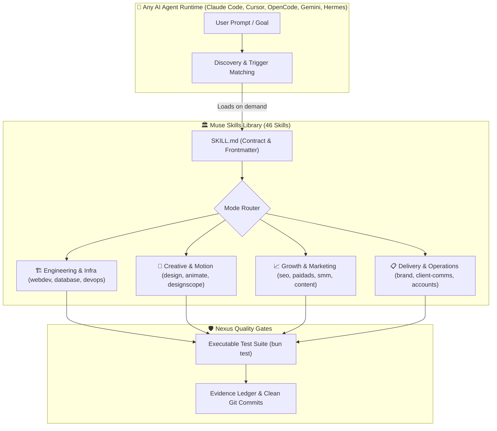

<div align="center">

# 🏛️ Muse Skills

**Production-grade skills for AI coding agents. Turn any coding assistant into an autonomous senior engineering team and full-service digital agency with persistent context, automated verification gates, and zero external dependencies.**

[](https://opensource.org/licenses/MIT)
[](https://github.com/harshsinghmp/muse-skills/releases)
[](#-complete-skill-catalog)
[](tests/)
[](#-runtime-compatibility)

</div>

```bash
# ⚡ Quick Start: Install all 46 skills globally in 1 command
npx skills add harshsinghmp/muse-skills
```

---

## 🧭 Overview

**Muse Skills** is an open-source suite of 46 portable AI agent skills engineered for modern developers, technical founders, and digital agencies. It provides battle-tested playbooks, structured workflows, and rigorous quality gates directly to your AI agents—without bloated frameworks, API wrappers, or runtime lock-in.

Every skill follows the open `SKILL.md` specification: rich intent triggers, step-by-step procedures, failure recovery routines, and automated verification tests. Your agent reads only what it needs, when it needs it, and verifies every claim before reporting success.

---

## ⚡ Why Muse Skills?

| Challenge with Vanilla AI Agents | The Muse Skills Advantage |
| :--- | :--- |
| **Context Amnesia**: Agents lose track of architecture, conventions, and past decisions between sessions. | **Persistent Context Architecture**: `context-anchor` and `updateagents` preserve project truth and architectural constraints indefinitely. |
| **Premature Victory**: Agents claim code works without running real tests, leaving broken builds behind. | **Automated Verification Gates**: Every workflow enforces executable test commands (`bun test`, `pytest`) before sign-off. |
| **Chaotic Releases**: Unformatted commits directly to production branches cause merge conflicts and regressions. | **Disciplined Release Flow**: The `git` skill automates semantic versioning, feature branches, and tag creation seamlessly. |
| **Messy Client Handoffs**: Scattered requirements, manual onboarding, and accidental credential leaks. | **End-to-End Agency Operations**: Dedicated skills for `brand` intake, `client-comms`, `accounts`, and `qa-launch` with zero credential leakage. |

---

## 📐 System Architecture

Muse Skills operates on a **Progressive Disclosure** model. Agents maintain a lightweight memory footprint by loading modular skills on demand, executing structured mode handlers, and validating outcomes through deterministic checks.



<details>
<summary><b>🔍 View Architectural Details & Runtime Specification (Click to expand)</b></summary>
<br/>

### 1. The Skill Contract (`SKILL.md`)
Each skill is completely self-contained within its own directory:
- **YAML Frontmatter**: Declares canonical name, trigger-rich description, argument hints, and tool prerequisites.
- **Trigger Index**: Maps natural language user requests to specific execution modes.
- **Reference Playbooks (`references/*.md`)**: Loaded selectively so agents consume only relevant instructions without exceeding context limits.
- **Verification Scripts (`scripts/*.ts`)**: Fast CLI utilities that programmatically audit deliverables, score readiness, and enforce standards.

### 2. Zero-Dependency Portability
- **Pure Markdown & Modern CLI**: Written in vendor-neutral Markdown and standards-compliant shell/TypeScript.
- **Cross-Platform**: Operates identically across Linux, macOS, and Windows.
- **Universal Agent Support**: Compatible with Claude Code, Cursor, OpenCode, Google Antigravity, Hermes, and any runtime implementing the standard skills protocol.

### 3. Verification Doctrine (Evidence Over Claims)
- No agent may claim completion without running executable proof commands.
- All code changes are validated against real tests, lint checks, and secret scans before commits are staged.
</details>

---

## 💼 Core Agency Divisions

Muse Skills organizes 46 specialized capabilities into four internal agency divisions:

### 1. 🏗️ Engineering & System Architecture
High-performance application development, database design, and cloud infrastructure.
- **Web & Full-Stack**: Complete web applications with Next.js, Astro, and clean component patterns ([`webdev`](webdev/README.md)).
- **Interactive Project Creation**: 6-stage scaffolding engine with framework, styling, and database wiring ([`new-project`](new-project/README.md)).
- **Full-Stack Refactoring**: 7-mode engine for cleaning legacy code, architecture, and query optimization ([`refactor`](refactor/README.md)).
- **Modern Infrastructure**: Cloudflare Workers, Pages, Zero Trust tunnels, and automated CI/CD pipelines ([`devops`](devops/README.md)).
- **Mobile Development**: Native cross-platform workflows with Expo and Capacitor ([`mobile`](mobile/README.md)).
- **Database Operations**: Query tuning, migrations, connection pools, and ORM schemas ([`database`](database/README.md)).

### 2. 🎨 Creative Design, UI/UX & Motion
Award-winning user interfaces, design systems, and rich interactive web experiences.
- **Design Systems & UI Kits**: Design tokens, component primitives, responsive layouts, and CRO patterns ([`design`](design/README.md)).
- **Unified Motion & 3D**: Three.js WebGL scenes, interactive canvas shaders, and smooth GSAP choreography ([`animate`](animate/README.md)).
- **Design System Extraction**: Reverse-engineer design tokens and component catalogs from existing websites ([`designscope`](designscope/README.md)).
- **Natural Copywriting**: Humanize AI drafts and apply battle-tested copywriting formulas ([`humanize`](humanize/README.md), [`content`](content/README.md)).

### 3. 📈 Growth, Marketing & Operations
End-to-end client acquisition, content generation, and agency delivery workflows.
- **Brand & Client Lifecycle**: Client intake briefs, secure credential delegation, and offboarding ([`brand`](brand/README.md)).
- **Organic Social & Video**: Social listening, viral content hooks, and multi-platform publishing ([`smm`](smm/README.md)).
- **Search & AI Discovery (SEO/AEO)**: Keyword clustering, semantic search optimization, and AI answer engine readiness ([`seo`](seo/README.md)).
- **Paid Advertising**: Multi-channel campaign planning across Google, Meta, LinkedIn, and TikTok ([`paidads`](paidads/README.md)).
- **Financial Operations**: DSO cashflow compression, automated invoice dunning, and margin analytics ([`accounts`](accounts/README.md)).
- **Client Communications**: Factual status updates grounded in verified Git evidence ([`client-comms`](client-comms/README.md)).

### 4. 🛡️ Technical Direction & Quality Assurance
The hardening gate that audits every line of code, design asset, and deployment.
- **Code Review & Standards**: Enforce clean architecture, type safety, and zero-defect delivery ([`code-review`](code-review/README.md)).
- **Autonomous Release Management**: Semantic versioning, changelog compilation, and branch lifecycles ([`git`](git/README.md)).
- **Launch Verification**: Comprehensive pre-launch smoke testing and cross-browser quality checks ([`qa-launch`](qa-launch/README.md)).
- **Security & Cloud Governance**: Zero-credential leakage scanning and proactive security audits ([`muse-security`](muse-security/README.md)).
- **Stress-Test Gauntlets**: Bounded feedback loops and blind A/B critique to eliminate regressions ([`gauntlet-loop`](gauntlet-loop/README.md)).

---

## 📦 Complete Skill Catalog

<details open>
<summary><b>📋 Browse All 46 Production Skills (Click to collapse/expand)</b></summary>
<br/>

| Skill | Description |
|:---|:---|
| [`accounts`](accounts/README.md) | Full financial operations department: client invoicing, bookkeeping, margin analysis, cashflow forecasting, and tax compliance across 7 modes. |
| [`ai-ready`](ai-ready/README.md) | Audits repositories for AI agent readiness and provisions the progressive disclosure documentation architecture. |
| [`analytics`](analytics/README.md) | Full data and measurement department: event tracking, KPI dashboards, marketing attribution, and conversion rate optimization across 5 modes. |
| [`animate`](animate/README.md) | Complete motion design, micro-interactions, layout transitions, animated SVGs, and interactive 3D WebGL scenes via Three.js. |
| [`audit`](audit/README.md) | Reflective project health audit diagnosing technical debt, documentation drift, and structural risks. |
| [`automation`](automation/README.md) | Process automation, scheduled background workflows, webhook integrations, and zero-credential browser relays. |
| [`brand`](brand/README.md) | Complete brand and client lifecycle engine: intake audits, secure credential delegation, cross-department briefs, and offboarding. |
| [`clean-system-cache`](clean-system-cache/README.md) | Cross-platform developer and system cache cleaner safely purging unreferenced package manager and build artifacts. |
| [`client-comms`](client-comms/README.md) | Professional client communication playbooks: evidence-backed status reports, change requests, and scope boundaries. |
| [`coach`](coach/README.md) | Meta-cognitive coaching skill guiding strategic project decisions, architectural tradeoffs, and focus alignment. |
| [`code-review`](code-review/README.md) | Thorough multi-perspective code review enforcing clean architecture, boundary invariants, and regression prevention. |
| [`content`](content/README.md) | Full content studio: SEO-optimized articles, conversion landing copy, email drip sequences, video scripts, and podcasts across 8 modes. |
| [`context-anchor`](context-anchor/README.md) | Session start and checkpoint skill capturing persistent context, active invariants, and open loops. |
| [`coupling-router`](coupling-router/README.md) | Coupling-aware routing engine calculating blast radius and managing parallel worktree isolation leases. |
| [`database`](database/README.md) | Unified database engineering: query tuning, schema migrations, indexing strategy, and connection pooling across 5 modes. |
| [`dead-letter`](dead-letter/README.md) | Captures, triages, and stores unhandled tasks, unexpected exceptions, and skipped workflows for future resolution. |
| [`design`](design/README.md) | Complete UI/UX design studio: design systems, OKLCH token palettes, component primitives, responsive layouts, and CRO patterns across 8 modes. |
| [`designscope`](designscope/README.md) | Reverse-engineers design systems, color palettes, typography hierarchies, and layout rules from existing websites. |
| [`devops`](devops/README.md) | Full infrastructure and reliability department: Cloudflare Workers and Pages, CI/CD pipelines, SSL, and DNS management across 7 modes. |
| [`evidence-ledger`](evidence-ledger/README.md) | Records verifiable claims, test runs, benchmark results, and commitments with cryptographic hash tracking. |
| [`gauntlet-loop`](gauntlet-loop/README.md) | Bounded adversarial stress-testing and critique loops driving autonomous self-refinement to production quality. |
| [`git`](git/README.md) | Autonomous Git operations: clean semantic commits, atomic feature branch PRs, and end-to-end release lifecycle automation. |
| [`growth`](growth/README.md) | Full growth strategy department: value proposition positioning, acquisition funnels, pricing models, and Product Hunt launches across 8 modes. |
| [`gtm`](gtm/README.md) | Comprehensive Go-To-Market strategy, product positioning, launch timelines, and distribution playbooks. |
| [`handoff`](handoff/README.md) | Generates structured session handoff artifacts enabling flawless continuity across different AI models and developer sessions. |
| [`humanize`](humanize/README.md) | Removes robotic phrasing, corporate jargon, and AI clichés to produce clear, authentic human prose. |
| [`incident-response`](incident-response/README.md) | Incident management playbooks for rapid triage, live root-cause isolation, emergency remediation, and post-mortems. |
| [`mobile`](mobile/README.md) | Complete mobile development: Expo React Native, Ionic Capacitor web-to-mobile wrapping, push notifications, and app store deployment across 5 modes. |
| [`muse-security`](muse-security/README.md) | Security hardening, vulnerability scanning, Cloudflare WAF rule management, and credential leak prevention. |
| [`new-project`](new-project/README.md) | Interactive project creator and Agent Engine provisioner with a 6-stage pipeline supporting Next.js, Astro, UnoCSS, and Drizzle. |
| [`ops`](ops/README.md) | Agency operations management: client workspace isolation, SLA tracking, deliverable verification, and hosting maintenance. |
| [`paidads`](paidads/README.md) | Full paid advertising department: campaign planning, ad copy, conversion pixel tracking, and cross-channel retargeting across 10 modes. |
| [`periodic-retreat`](periodic-retreat/README.md) | Structured milestone review reflecting on achievements, refining roadmap priorities, and purging deprecated patterns. |
| [`pua`](pua/README.md) | Prompt understanding and augmentation engine expanding ambiguous prompts into precise technical specifications. |
| [`qa-launch`](qa-launch/README.md) | Pre-launch QA testing: cross-browser responsive checks, smoke test automation, visual regression audits, and deployment sign-off. |
| [`refactor`](refactor/README.md) | Universal 7-mode refactoring engine: code cleanup, architectural decoupling, performance tuning, and query optimization. |
| [`relay`](relay/README.md) | Asynchronous agent-to-agent communication relay facilitating structured handoffs and task coordination. |
| [`research`](research/README.md) | Deep technical research and market intelligence: competitive analysis, library evaluations, and synthesis reports. |
| [`retain`](retain/README.md) | Post-delivery client retention: automated health checks, customer success workflows, NPS tracking, and proactive renewal reviews. |
| [`sales-enablement`](sales-enablement/README.md) | B2B sales collateral generator: pitch decks, discovery call scripts, objection-handling matrices, and ROI calculators. |
| [`secretary`](secretary/README.md) | Administrative meeting transcription, executive summaries, action item extraction, and agenda scheduling. |
| [`seo`](seo/README.md) | Technical SEO, AI Answer Engine Optimization (AEO), keyword clustering, structured semantic data, and core web vitals. |
| [`smm`](smm/README.md) | Social media management: organic strategy, viral hooks, multi-platform content scheduling, and engagement analytics across 6 modes. |
| [`telegram`](telegram/README.md) | Telegram bot development: webhook management, interactive menus, inline keyboards, and automated notifications. |
| [`updateagents`](updateagents/README.md) | Scaffolds and synchronizes the 9-folder `.agents/` container, modular standards, brand tokens, and persistent memory. |
| [`updatedocs`](updatedocs/README.md) | Documentation synchronization engine detecting doc drift and updating markdown files to match implementation reality. |

</details>

---

## 💻 Installation & Usage

### Option 1: Install Complete Suite (Recommended)

Install all 46 skills globally in one command:

```bash
npx skills add harshsinghmp/muse-skills
```

Or install scoped specifically to your current project:

```bash
npx skills add harshsinghmp/muse-skills --scope project
```

### Option 2: Install Individual Skills

Pick and install only the specific skills your project requires:

```bash
# Add full-stack web development and refactoring
npx skills add harshsinghmp/muse-skills --skill webdev
npx skills add harshsinghmp/muse-skills --skill refactor

# Add UI/UX design studio and motion animation
npx skills add harshsinghmp/muse-skills --skill design
npx skills add harshsinghmp/muse-skills --skill animate

# Add autonomous git release operations
npx skills add harshsinghmp/muse-skills --skill git
```

---

## 🧪 Verification & Quality Standards

Every skill in Muse Skills is validated through an automated test suite guaranteeing functional reliability, documentation parity, and security compliance:

```bash
# Run complete test suite (116 tests, 2,797 assertions)
bun test

# Run code linter and formatting checks
bun run lint

# Run strict TypeScript type verification
bun run type-check
```

- **100% Green Test Suite**: 116 tests across 7 comprehensive test files validating end-to-end multi-skill execution.
- **Zero-Secret Leakage Guarantee**: Enforced by pre-commit hooks and automated credential scanning pipelines.
- **Documentation Parity**: Automated tests verify that every single skill, mode, parameter, and CLI flag is accurately documented across all manifests.

---

## 📚 Historical Archives & Reports

- **Previous README Backup**: View the historical v5.0.0 documentation archive at [`docs/README-v5.0.0.md`](docs/README-v5.0.0.md).
- **Executive Session Reports**: Inspect our comprehensive milestone and architectural conclusion reports at [`.agents/reports/latest.html`](.agents/reports/latest.html).

---

## 🤝 Contributing

Contributions are welcome! Please review our [Contributing Guidelines](CONTRIBUTING.md) and note the following core principles:
1. **Never commit directly to `main`**: Always branch from `dev` (`feat/<skill-or-feature>`).
2. **Atomic PR per Skill**: Keep pull requests focused on a single skill or capability.
3. **Green Test Suite**: Ensure `bun test` passes with zero errors before submitting.

---

## 📄 License

Muse Skills is open-source software licensed under the [MIT License](LICENSE).
