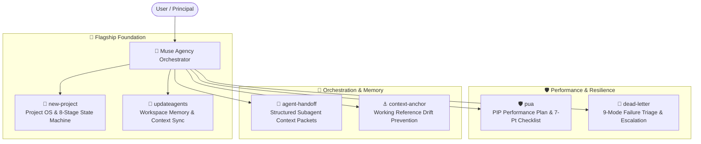

<div align="center">

# 🏛️ Muse Skills

**Universal AI agent skills for Project OS provisioning, memory synchronization, PIP performance enforcement, and subagent orchestration.**

[](https://opensource.org/licenses/MIT)
[](https://github.com/harshsinghmp/muse-skills/releases)
[](#-available-skills)
[](https://github.com/harshsinghmp)
[](#-universal-agent-compatibility)

</div>

---

## 🧭 What is this?

**Muse Skills** is a curated, production-grade suite of AI agent capabilities designed for the **LifeOS** ecosystem and universal agent runtimes (`npx skills`, Claude Code, Hermes, OpenAI Codex, Cursor, Gemini CLI, and OpenCode).

Each skill is authored with rock-solid YAML frontmatter and standard RFC markdown sections (`When to Use`, `Quick Reference`, `Procedure`, `Pitfalls`, and `Verification`), ensuring 100% deterministic, zero-hallucination execution across all major LLMs.

---

## ⚡ Quick Start

### 1. Install Specific Skills (Shorthand)

Install individual skills directly into your workspace using the standard `npx skills` CLI:

```bash
# 🚀 Flagship Skills (Project OS Provisioner & Memory Synchronizer)
npx skills add harshsinghmp/muse-skills --skill new-project
npx skills add harshsinghmp/muse-skills --skill updateagents

# 🛡️ Performance Enforcement & Hardcore Debugging
npx skills add harshsinghmp/muse-skills --skill pua

# 🤝 Subagent Orchestration & Session Reliability Suite
npx skills add harshsinghmp/muse-skills --skill agent-handoff
npx skills add harshsinghmp/muse-skills --skill dead-letter
npx skills add harshsinghmp/muse-skills --skill context-anchor
```

### 2. Install All Skills at Once

Install the entire 6-skill suite into your current repository in a single command:

```bash
npx skills add harshsinghmp/muse-skills
```

*(Direct GitHub tree URL syntax `npx skills add https://github.com/harshsinghmp/muse-skills/tree/main/<skillname>` is also fully supported).*

---

## 📐 System Architecture



---

## 📋 Available Skills

| Skill | Category | Primary Triggers | Description |
| :--- | :--- | :--- | :--- |
| [**`new-project`**](new-project/README.md) | **Flagship** | `/new-project`, `scaffold app` | Provision canonical `/docs/`, 8-stage reality machine (`STATE.md`), Council governance, and skill presets. |
| [**`updateagents`**](updateagents/README.md) | **Flagship** | `update agents.md`, `sync memory` | Auto-discover, scan, and sync agent memory files (`AGENTS.md`, `CLAUDE.md`, `.cursorrules`) in workspace root. |
| [**`pua`**](pua/README.md) | **Reliability** | `PIP`, `/pua`, `try harder`, `figure it out` | Put your AI on a Performance Improvement Plan. Forces exhaustive problem-solving with big-tech perf rhetoric. |
| [**`agent-handoff`**](agent-handoff/README.md) | **Multi-Agent** | `/handoff`, `/agent-handoff` | Generate structured context packets before dispatching subagents. Prevents context drift and ruled-out repeats. |
| [**`dead-letter`**](dead-letter/README.md) | **Reliability** | `/dead-letter`, `/dl` | Capture failed/blocked agent tasks into structured failure records with actionable retry or escalation packets. |
| [**`context-anchor`**](context-anchor/README.md) | **Multi-Agent** | `/anchor`, `/context-anchor` | Drop lightweight working reference snapshots (`.claude/anchor.md`) to prevent cascading context drift. |

---

## 🔍 Detailed Skill Breakdown

### 🚀 `new-project` (Flagship #1)

Interactive project creator and Project Operating System provisioner. Bootstraps the 10 Canonical `/docs/` Project Brain, 8-Stage Reality Machine (`STATE.md`), Council Governance (`AGENTS.md`), dynamic `llms.txt`, `.gitignore`, and selective skill bundles into any repository.

```bash
npx skills add harshsinghmp/muse-skills --skill new-project
```

- **Path Auto-Discovery**: Scans `/home/harsh/Projects/` and suggests immediate target locations.
- **Framework Archetypes**: Next.js 16 (App Router + Tailwind v4 + React 19), Astro (Static/SSR), Vite + React, Node/Bun API, WordPress/PHP.
- **Project OS Assets**: Generates `.agentrules`, `AGENTS.md` (Muse Council hierarchy), `CLAUDE.md`, `STATE.md` (8-stage reality machine), `llms.txt` bundler, and hardened `.gitignore`.
- **Pre-configured Presets**: `agency-suite` (28 design & taste skills), `design`, `fullstack`, `growth`, `all`, `none`.

[Read full documentation →](new-project/README.md)

---

### 🧠 `updateagents` (Flagship #2)

Automatically discovers, reads, and updates agent memory files (`AGENTS.md`, `CLAUDE.md`, `.cursorrules`, etc.) in the current working directory.

```bash
npx skills add harshsinghmp/muse-skills --skill updateagents
```

- **Workspace-Scoped Discovery**: Scans current repository root only; never traverses parent paths.
- **Ecosystem Integration**: Reads output from `cavemem`, `codegraph`, `rtk`, `memoryagent`, and `ponytail`.
- **Intelligent Synthesis**: Extracts essential build/test commands, architecture flows, conventions, and non-obvious gotchas.
- **Safe Incremental Updates**: Preserves user-written rules and architectural decisions while refreshing stale documentation.

[Read full documentation →](updateagents/README.md)

---

### 🛡️ `pua` (PIP Performance Improvement Plan)

Put your AI on a Performance Improvement Plan. Forces exhaustive problem-solving with Western big-tech performance culture rhetoric and structured debugging.

```bash
npx skills add harshsinghmp/muse-skills --skill pua
```

- **Three Non-Negotiables**: Exhaust all options (*Bias for Action*), Act before asking (*Dive Deep*), and Take the initiative (*Ownership*).
- **4-Tier Pressure Escalation**: L1 Verbal Warning ➔ L2 Written Feedback ➔ L3 Formal PIP ➔ L4 Final Review.
- **Universal 5-Step Methodology**: Pattern Recognition ➔ Elevate ➔ Self-Review ➔ Execute ➔ Retrospective.
- **Mandatory 7-Point Checklist**: Word-by-word error analysis, proactive search, 50-line raw context, inverted assumptions, and minimal reproductions.
- **8 Big-Tech Flavor Packs**: Amazon Leadership Principles, Google Calibration, Meta Move Fast, Netflix Keeper Test, Musk Hardcore, Jobs A-Player, Stripe Craft, and Competitive Horse Race.

[Read full documentation →](pua/README.md)

---

### 🤝 `agent-handoff`

Generate a structured context packet before dispatching any subagent. Prevents context drift, hallucinated constraints, and re-exploring dead ends.

```bash
npx skills add harshsinghmp/muse-skills --skill agent-handoff
```

- **Explicit Working Model**: Externalizes orchestrator facts, ruled-out failed paths, and exact line ranges.
- **Hard Negative Boundaries**: Codifies `MUST NOT` constraints that propagate cleanly to subagent prompts.
- **Deterministic Verification**: Establishes unambiguous success criteria before work begins.
- **Persistence**: Writes records to `.claude/handoff-<timestamp>.md`.

[Read full documentation →](agent-handoff/README.md)

---

### 📮 `dead-letter`

Capture failed or blocked tasks before context clears. Categorizes failure modes into a 9-part taxonomy, extracts what was learned, and generates either a mechanical retry prompt or an escalation decision point.

```bash
npx skills add harshsinghmp/muse-skills --skill dead-letter
```

- **9-Code Failure Taxonomy**: `BLOCKED-CRED`, `BLOCKED-PERM`, `BLOCKED-DATA`, `BLOCKED-AMBIG`, `BLOCKED-RATE`, `FAILED-LOGIC`, `FAILED-TOOL`, `FAILED-SCOPE`, and `PARTIAL`.
- **Preserves Partial Output**: Guarantees partial file writes and intermediate states are not lost.
- **Actionable Escalations**: Generates specific decision questions routed to Council agents (`NEXUS`, `SOL`, `JASPER`, `CREW`).

[Read full documentation →](dead-letter/README.md)

---

### ⚓ `context-anchor`

Drop a compact working reference snapshot in `<project-root>/.claude/anchor.md` to prevent cascading context drift across long sessions, breaks, or task switches.

```bash
npx skills add harshsinghmp/muse-skills --skill context-anchor
```

- **Zero-Filler State**: Captures active state, key architectural decisions with "why" rationale, and ruled-out paths in under 15 lines.
- **Atomic Next Step**: Defines the single concrete next action with exact file and line references.
- **Drift Elimination**: Prevents models from hallucinating against stale context after long conversations.

[Read full documentation →](context-anchor/README.md)

---

## 🌐 Universal Agent Compatibility

All skills in this repository follow the universal agent skill standard:

| Agent Platform | Compatibility | Ingestion Mechanism |
|:---|:---:|:---|
| **`npx skills` CLI** | ✅ Native | Full CLI discovery, dependency resolution & installation |
| **Claude Code & Desktop** | ✅ Native | Parses YAML frontmatter & executes structured markdown workflows |
| **Hermes** | ✅ Native | Natively reads `metadata.hermes`, tool dependencies & platform constraints |
| **OpenAI Codex & Cursor** | ✅ Native | Compatible with agent prompt schemas & `.cursorrules` ingestion |
| **Gemini CLI & Antigravity** | ✅ Native | Compatible with agent tools, system prompts & subagent dispatch |
| **OpenCode & Pi** | ✅ Native | Universal markdown skill ingestion |

---

## 📁 Repository Structure

```
muse-skills/
├── new-project/                    # Project OS & governance scaffolder (Flagship #1)
│   ├── agents/
│   │   └── openai.yaml             # Agent tool definition
│   ├── references/
│   │   └── project-os-architecture.md
│   ├── scripts/
│   │   └── new-project.ts          # Scaffolder engine
│   ├── README.md
│   └── SKILL.md
│
├── updateagents/                   # Memory & context synchronization (Flagship #2)
│   ├── agents/
│   │   └── openai.yaml
│   ├── examples/
│   │   └── before-after.md
│   ├── references/
│   │   ├── discovery-commands.md
│   │   └── memory-file-priorities.md
│   ├── scripts/
│   │   └── validate-memory-file.sh # Memory file validator
│   ├── README.md
│   └── SKILL.md
│
├── pua/                            # PIP performance & structured debugging
│   ├── agents/
│   │   └── openai.yaml
│   ├── examples/
│   │   └── sample-pip-report.md
│   ├── README.md
│   └── SKILL.md
│
├── agent-handoff/                  # Structured subagent context packet generator
│   ├── agents/
│   │   └── openai.yaml
│   ├── examples/
│   │   └── sample-handoff.md
│   ├── README.md
│   └── SKILL.md
│
├── context-anchor/                 # Working reference snapshot generator
│   ├── agents/
│   │   └── openai.yaml
│   ├── examples/
│   │   └── sample-anchor.md
│   ├── README.md
│   └── SKILL.md
│
├── dead-letter/                    # Failed/blocked task triage & capture
│   ├── agents/
│   │   └── openai.yaml
│   ├── examples/
│   │   └── sample-dead-letter.md
│   ├── README.md
│   └── SKILL.md
│
├── CONTRIBUTING.md                 # Meaningful Git Commit Protocol
├── LICENSE                         # MIT License
├── package.json                    # Package metadata & keywords
├── README.md                       # Comprehensive repository documentation
└── skills.json                     # Skill registry catalog
```

---

## 📜 Contributing & Commit Protocol

All commits across this repository must adhere to the **[Meaningful Git Commit Protocol](CONTRIBUTING.md)**:

```
<type>(<scope>): <concise-imperative-summary>

- Why: [Brief explanation of the motivation/problem solved]
- What: [Bullet list of specific files, components, or mechanisms changed]
- Verification: [Evidence that tests, builds, and validation probes passed]
```

See [CONTRIBUTING.md](CONTRIBUTING.md) for full guidelines.

---

## 📄 License

[MIT](LICENSE) © [Harsh](https://github.com/harshsinghmp)

---

<div align="center">

[](https://star-history.com/#harshsinghmp/muse-skills&Date)

</div>
