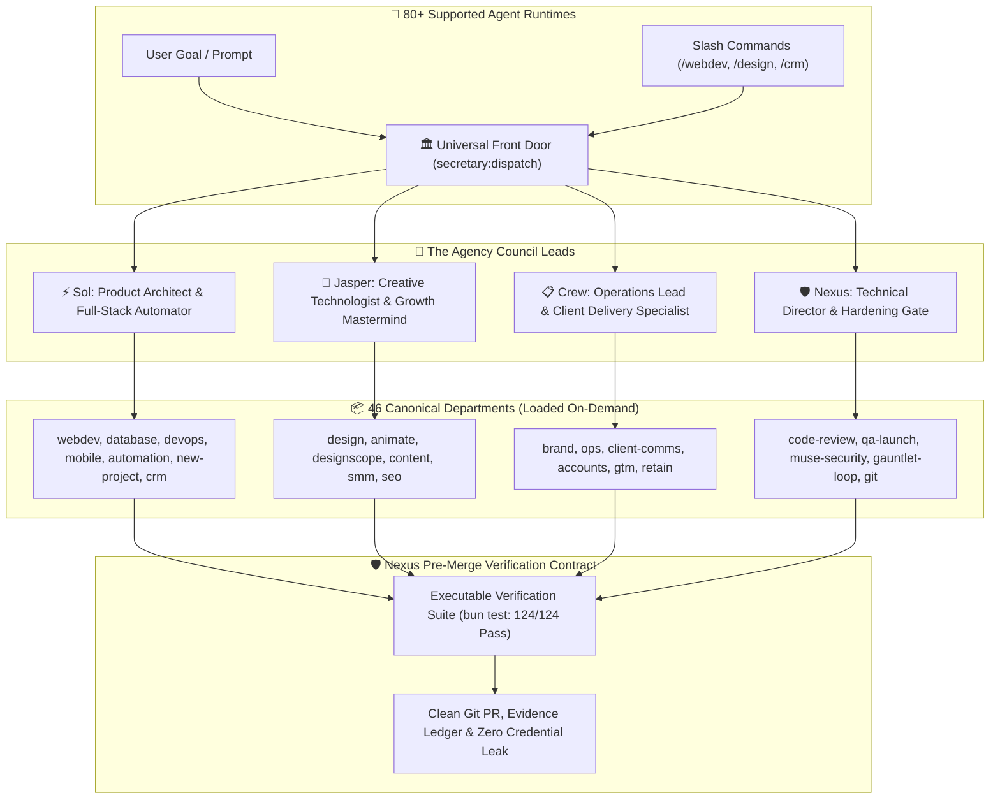

<div align="center">

# 🏛️ Muse Skills

**Production-grade skills for AI coding agents. Turn any coding assistant into an autonomous senior engineering team and full-service digital agency with persistent context, automated verification gates, and zero external dependencies.**

[](https://opensource.org/licenses/MIT)
[](https://github.com/harshsinghmp/muse-skills/releases)
[](#-complete-skill-catalog)
[](tests/)
[](#-runtime-compatibility)

</div>

```bash
# ⚡ Option A: Quick Install (Agent Natural Language Discovery)
npx skills add harshsinghmp/muse-skills

# 🚀 Option B: Instant Remote Setup (Skills + 174 Native Slash Commands — No Clone Needed)
curl -fsSL https://raw.githubusercontent.com/harshsinghmp/muse-skills/main/scripts/install.sh | bash

# 🛠️ Option C: Manual Setup (From Source)
git clone https://github.com/harshsinghmp/muse-skills.git && cd muse-skills && bun run setup
```

---

## 🆕 What's New in v7.1.0

Autonomous multi-agent concurrency leases (`secretary`), tri-vector agency coaching (`coach`), and self-healing circuit breakers (`dead-letter`) across 189 verified tests.
See the [Full Changelog](CHANGELOG.md) or explore all [GitHub Releases](https://github.com/harshsinghmp/muse-skills/releases).

---

## 🧭 Overview

**Muse Skills** transforms vanilla AI coding assistants into an autonomous, senior full-service engineering team and digital agency. Built on the open `SKILL.md` RFC specification, it injects 46 production-grade departments—spanning full-stack engineering, motion design, growth hacking, client operations, and rigorous quality auditing—directly into your agent harness with zero runtime bloat, zero API lock-in, and zero credential leakage.

Unlike brittle system prompts or heavy wrapper frameworks, Muse Skills enforces **Progressive Disclosure**: agents read only what they need, execute structured mode playbooks, and verify every single claim against executable tests before declaring work complete.

Every skill follows the open `SKILL.md` specification: rich intent triggers, step-by-step procedures, failure recovery routines, and automated verification tests. Your agent reads only what it needs, when it needs it, and verifies every claim before reporting success.

---

## ⚡ Why Muse Skills?

| Challenge with Vanilla AI Agents | The Muse Skills Advantage |
| :--- | :--- |
| **Prompt Fatigue & Manual Routing**: Users must remember exact prompts, sub-skills, or paths for every task. | **Universal Central Dispatch**: `secretary:dispatch` automatically inspects user intent on session start, maps to the right Council Lead (**Sol**, **Jasper**, **Crew**, **Nexus**), and routes to the exact mode playbook. |
| **Context Amnesia**: Agents lose track of architecture, conventions, and past decisions between sessions. | **Persistent Cognitive Context**: `context-anchor` and `updateagents` preserve project truth, active constraints, and architectural invariants indefinitely. |
| **Premature Victory**: Agents claim code works without running real tests, leaving broken builds behind. | **Automated Verification Gates**: Every workflow enforces executable test commands (`bun test`, `pytest`) before sign-off (Evidence over Claims). |
| **Chaotic Releases**: Unformatted commits directly to production branches cause merge conflicts and regressions. | **Disciplined Release Flow**: The `git` skill automates semantic versioning, feature branches, and tag creation seamlessly. |
| **Harness Fragmentation**: Custom commands work in one IDE or CLI but break in another. | **Multi-Harness Slash Commands**: Instant native commands across OpenCode, Antigravity/Gemini CLI, Cursor, Windsurf, Claude Code, and Hermes. |
| **Messy Client Handoffs**: Scattered requirements, manual onboarding, and accidental credential leaks. | **End-to-End Agency Operations**: Dedicated skills for `brand` intake, `client-comms`, `accounts`, and `qa-launch` with zero credential leakage. |

---

## 📐 System Architecture

Muse Skills operates on a **Progressive Disclosure** and **Autonomous Council Dispatch** model. Agents maintain a lean, lightweight context footprint by loading modular skills on demand, executing structured mode handlers, and validating outcomes through deterministic checks.


```mermaid
flowchart TD
    subgraph Harness ["🤖 80+ Supported Agent Runtimes"]
        UserPrompt["User Goal / Prompt"] --> Dispatcher["🏛️ Universal Front Door (secretary:dispatch)"]
        SlashCmd["Slash Commands (/webdev, /design, /crm)"] --> Dispatcher
    end

    subgraph Council ["👔 The Agency Council Leads"]
        Dispatcher --> Sol["⚡ Sol: Product Architect & Full-Stack Automator"]
        Dispatcher --> Jasper["🎨 Jasper: Creative Technologist & Growth Mastermind"]
        Dispatcher --> Crew["📋 Crew: Operations Lead & Client Delivery Specialist"]
        Dispatcher --> NexusLead["🛡️ Nexus: Technical Director & Hardening Gate"]
    end

    subgraph SkillLayer ["📦 46 Canonical Departments (Loaded On-Demand)"]
        Sol --> EngSkills["webdev, database, devops, mobile, automation, new-project, crm"]
        Jasper --> DesignSkills["design, animate, designscope, content, smm, seo"]
        Crew --> OpsSkills["brand, ops, client-comms, accounts, gtm, retain"]
        NexusLead --> QualitySkills["code-review, qa-launch, muse-security, gauntlet-loop, git"]
    end

    subgraph QualityGates ["🛡️ Nexus Pre-Merge Verification Contract"]
        EngSkills --> Gate["Executable Verification Suite (bun test: 124/124 Pass)"]
        DesignSkills --> Gate
        OpsSkills --> Gate
        QualitySkills --> Gate
        Gate --> Output["Clean Git PR, Evidence Ledger & Zero Credential Leak"]
    end
```

<details>
<summary><b>🔍 View Architectural Details & Runtime Specification (Click to expand)</b></summary>
<br/>

### 1. The Skill Contract (`SKILL.md`)
Each skill is completely self-contained within its own directory:
- **YAML Frontmatter**: Declares canonical name, trigger-rich description, argument hints, and tool prerequisites.
- **Trigger Index**: Maps natural language user requests to specific execution modes.
- **Reference Playbooks (`references/*.md`)**: Loaded selectively so agents consume only relevant instructions without exceeding context limits.
- **Verification Scripts (`scripts/*.ts`)**: Fast CLI utilities that programmatically audit deliverables, score readiness, and enforce standards.

### 2. Zero-Dependency Portability
- **Pure Markdown & Modern CLI**: Written in vendor-neutral Markdown and standards-compliant shell/TypeScript.
- **Cross-Platform**: Operates identically across Linux, macOS, and Windows.
- **Universal Agent Support**: Compatible with Claude Code, Cursor, OpenCode, Google Antigravity, Hermes, and any runtime implementing the standard skills protocol.

### 3. Verification Doctrine (Evidence Over Claims)
- No agent may claim completion without running executable proof commands.
- All code changes are validated against real tests, lint checks, and secret scans before commits are staged.
</details>

---

## 💼 Core Agency Divisions

Muse Skills organizes 46 specialized capabilities into four internal agency divisions:

### 1. 🏗️ Engineering & System Architecture
High-performance application development, database design, and cloud infrastructure.
- **Web & Full-Stack**: Complete web applications with Next.js, Astro, and clean component patterns ([`webdev`](skills/agency-delivery/webdev/README.md)).
- **Interactive Project Creation**: 6-stage scaffolding engine with framework, styling, and database wiring ([`new-project`](skills/core-engine/new-project/README.md)).
- **Full-Stack Refactoring**: 7-mode engine for cleaning legacy code, architecture, and query optimization ([`refactor`](skills/design-interface/refactor/README.md)).
- **Modern Infrastructure**: Cloudflare Workers, Pages, Zero Trust tunnels, and automated CI/CD pipelines ([`devops`](skills/agency-delivery/devops/README.md)).
- **Mobile Development**: Native cross-platform workflows with Expo and Capacitor ([`mobile`](skills/agency-delivery/mobile/README.md)).
- **Database Operations**: Query tuning, migrations, connection pools, and ORM schemas ([`database`](skills/agency-delivery/database/README.md)).

### 2. 🎨 Creative Design, UI/UX & Motion
Award-winning user interfaces, design systems, and rich interactive web experiences.
- **Design Systems & UI Kits**: Design tokens, component primitives, responsive layouts, and CRO patterns ([`design`](skills/agency-delivery/design/README.md)).
- **Unified Motion & 3D**: Three.js WebGL scenes, interactive canvas shaders, and smooth GSAP choreography ([`animate`](skills/design-interface/animate/README.md)).
- **Design System Extraction**: Reverse-engineer design tokens and component catalogs from existing websites ([`designscope`](skills/design-interface/designscope/README.md)).
- **Natural Copywriting**: Humanize AI drafts and apply battle-tested copywriting formulas ([`humanize`](skills/quality-review/humanize/README.md), [`content`](skills/agency-delivery/content/README.md)).

### 3. 📈 Growth, Marketing & Operations
End-to-end client acquisition, content generation, and agency delivery workflows.
- **CRM & Automated Flows**: Audience segmentation, RFM scoring, welcome drips, cart recovery, and deliverability infrastructure ([`crm`](skills/agency-delivery/crm/README.md)).
- **Brand & Client Lifecycle**: Client intake briefs, secure credential delegation, and offboarding ([`brand`](skills/agency-delivery/brand/README.md)).
- **Organic Social & Video**: Social listening, viral content hooks, and multi-platform publishing ([`smm`](skills/agency-delivery/smm/README.md)).
- **Search & AI Discovery (SEO/AEO)**: Keyword clustering, semantic search optimization, and AI answer engine readiness ([`seo`](skills/agency-delivery/seo/README.md)).
- **Paid Advertising**: Multi-channel campaign planning across Google, Meta, LinkedIn, and TikTok ([`paidads`](skills/agency-delivery/paidads/README.md)).
- **Financial Operations**: DSO cashflow compression, automated invoice dunning, and margin analytics ([`accounts`](skills/agency-delivery/accounts/README.md)).
- **Client Communications**: Factual status updates grounded in verified Git evidence ([`client-comms`](skills/agency-delivery/client-comms/README.md)).

### 4. 🛡️ Technical Direction & Quality Assurance
The hardening gate that audits every line of code, design asset, and deployment.
- **Code Review & Standards**: Enforce clean architecture, type safety, and zero-defect delivery ([`code-review`](skills/quality-review/code-review/README.md)).
- **Autonomous Release Management**: Semantic versioning, changelog compilation, and branch lifecycles ([`git`](skills/core-engine/git/README.md)).
- **Launch Verification**: Comprehensive pre-launch smoke testing and cross-browser quality checks ([`qa-launch`](skills/agency-delivery/qa-launch/README.md)).
- **Security & Cloud Governance**: Zero-credential leakage scanning and proactive security audits ([`muse-security`](skills/quality-review/muse-security/README.md)).
- **Stress-Test Gauntlets**: Bounded feedback loops and blind A/B critique to eliminate regressions ([`gauntlet-loop`](skills/quality-review/gauntlet-loop/README.md)).

---

## 📦 Complete Skill Catalog

<details open>
<summary><b>📋 Browse All 46 Production Skills (Click to collapse/expand)</b></summary>
<br/>

| Skill | Description |
|:---|:---|
| [`accounts`](skills/agency-delivery/accounts/README.md) | Full financial operations department: client invoicing, bookkeeping, margin analysis, cashflow forecasting, and tax compliance across 7 modes. |
| [`analytics`](skills/agency-delivery/analytics/README.md) | Full data and measurement department: event tracking, KPI dashboards, marketing attribution, and conversion rate optimization across 5 modes. |
| [`animate`](skills/design-interface/animate/README.md) | Complete motion design, micro-interactions, layout transitions, animated SVGs, and interactive 3D WebGL scenes via Three.js. |
| [`audit`](skills/quality-review/audit/README.md) | Knowledge hygiene and referential integrity auditor for AI agent memory banks, documentation trees, and knowledge bases. |
| [`automation`](skills/agency-delivery/automation/README.md) | Full automation and AI services department: workflow automation, chatbots, AI agents, RAG pipelines, integrations, prompt engineering, and voice AI agents across 7 modes. |
| [`brand`](skills/agency-delivery/brand/README.md) | Client and brand lifecycle engine: comprehensive brand intake, autonomous web research, sales pipeline qualification, ad and payment account access, cross-department briefs, and offboarding across 8 modes. |
| [`clean-system-cache`](skills/reflection-maintenance/clean-system-cache/README.md) | Safe cross-platform developer, designer, and browser cache purge across 15+ package managers, IDEs, and browser engines. |
| [`client-comms`](skills/agency-delivery/client-comms/README.md) | Client-facing communication: status reporting, change-request triage, project handover, and client feedback intake across 4 modes. |
| [`coach`](skills/reflection-maintenance/coach/README.md) | Tri-vector autonomous agency coach for internal teams, client boundary defense, and founder leverage calibration across 4 modes. |
| [`code-review`](skills/quality-review/code-review/README.md) | Language-agnostic, rigorous code review derived from Linus Torvalds' corpus: correctness, simplicity, boundary invariants, and evidence over claims. |
| [`content`](skills/agency-delivery/content/README.md) | Full content studio: SEO-aware blog posts, conversion copywriting, email sequences, video scripts, podcasts, and case studies across 8 modes. |
| [`context-anchor`](skills/context-orchestration/context-anchor/README.md) | Drop a working reference anchor at any point in a session to prevent context drift, and park parallel client workstreams for instant switching. |
| [`coupling-router`](skills/context-orchestration/coupling-router/README.md) | Coupling-aware architectural delegation, blast radius calculation, and shared-worktree lease arbitration for multi-agent workflows. |
| [`crm`](skills/agency-delivery/crm/README.md) | Full customer relationship and marketing flow department: audience segmentation, RFM scoring, welcome onboarding, cart abandonment recovery, lead nurture journeys, winback, deliverability DNS (SPF/DKIM/DMARC), and SMS triggers across 7 modes. |
| [`database`](skills/agency-delivery/database/README.md) | Unified database engineering: read-only query execution, slow-query diagnosis, index design, RLS security policies, performance tuning, and pooling across 6 modes. |
| [`dead-letter`](skills/quality-review/dead-letter/README.md) | Capture, triage, and quarantine failed tasks before they disappear, generating bounded retry packets or escalation questions. |
| [`design`](skills/agency-delivery/design/README.md) | Full website design department: UI design, UX flows, wireframes, brand identity, social templates, UI kits, visual storytelling, and interactive 3D web scenes across 11 modes. |
| [`designscope`](skills/design-interface/designscope/README.md) | Reverse-engineers design systems, color palettes, typography hierarchies, layout trees, and tokens from existing websites, images, or Figma. |
| [`devops`](skills/agency-delivery/devops/README.md) | Full infrastructure and reliability department: hosting, CI/CD pipelines, DNS, Cloudflare edge and Workers, security hardening, monitoring, and incident response across 7 modes. |
| [`evidence-ledger`](skills/context-orchestration/evidence-ledger/README.md) | Persistent per-project evidence tracking and source-cited claim verification gate enforcing 'No source, no claim. No verification path, no release.' |
| [`gauntlet-loop`](skills/quality-review/gauntlet-loop/README.md) | Bounded multi-agent quality improvement loop preventing infinite iterations, self-grading delusions, and regression churn. |
| [`git`](skills/core-engine/git/README.md) | Autonomous end-to-end Git & GitHub release engine: 9-tier anti-slop triage, 4-phase branching, surgical test gating, and semver release automation. |
| [`growth`](skills/agency-delivery/growth/README.md) | Full strategy and scaling department: positioning, marketing funnels, pricing, product launch, competitor analysis, community building, and growth audits across 10 modes. |
| [`gtm`](skills/agency-delivery/gtm/README.md) | Outbound & developer GTM department: account research, lead scoring, cold email, TAB customer discovery, champion enablement, and founder sales across 9 modes. |
| [`humanize`](skills/quality-review/humanize/README.md) | Editorial review and prose humanization system eliminating AI writing artifacts, formulaic patterns, and robotic cadence without altering facts or voice. |
| [`incident-response`](skills/agency-delivery/incident-response/README.md) | Live incident command: severity triage, stop-the-bleeding mitigation playbooks, status communication, and blameless post-mortems across 4 modes. |
| [`mobile`](skills/agency-delivery/mobile/README.md) | Full mobile app department: iOS (SwiftUI), Android (Compose), cross-platform (React Native/Expo, Flutter), and PWA across 5 modes. |
| [`muse-security`](skills/quality-review/muse-security/README.md) | Unified security authority: CVE triage, automated remediation playbooks, Cloud WAF architectures (GCP/Cloudflare), and SAST review across 6 modes. |
| [`new-project`](skills/core-engine/new-project/README.md) | Purpose-First interactive project creator, companion configurator, DOX Engine, and Agent Engine provisioner with a 6-stage pipeline. |
| [`ops`](skills/agency-delivery/ops/README.md) | Internal agency operations department: client onboarding, proposals, statements of work, milestone tracking, retros, vendor management, Obsidian PKM vaults, and agency legal templates across 10 modes. |
| [`paidads`](skills/agency-delivery/paidads/README.md) | Full paid advertising department: campaign planning, ad copy, pixel tracking, and cross-channel retargeting across Google, Meta, LinkedIn, TikTok, and YouTube across 10 modes. |
| [`periodic-retreat`](skills/reflection-maintenance/periodic-retreat/README.md) | Quarterly personal and project strategic retreat facilitator conducting multi-scale audits of project health, architecture debt, and OKR handoffs. |
| [`pua`](skills/quality-review/pua/README.md) | Performance Improvement Plan engine forcing exhaustive problem-solving and structured debugging when tasks stall. |
| [`qa-launch`](skills/agency-delivery/qa-launch/README.md) | Pre-launch quality gate: cross-browser and device matrix planning, critical-path functional verification, release checklist, and regression sweeps across 4 modes. |
| [`refactor`](skills/design-interface/refactor/README.md) | Universal 7-mode refactoring engine: UI components, code cleanup, architectural decoupling, runtime performance, and database schemas. |
| [`relay`](skills/context-orchestration/relay/README.md) | Bidirectional agent handoff and session resumption engine with ambient continuity maintaining an always-current HANDOFF.md live-state file. |
| [`research`](skills/agency-delivery/research/README.md) | Client-serving research department: user research, market sizing, competitive intelligence, and due-diligence entity dossiers across 3 modes. |
| [`retain`](skills/agency-delivery/retain/README.md) | Post-delivery retention loop: scheduled check-ins, monthly value notes, quarterly business reviews, review asks, and churn-watch signals across 6 modes. |
| [`sales-enablement`](skills/agency-delivery/sales-enablement/README.md) | Pre-sale sales enablement department: demo scripts, objection-handling handbooks, one-pagers, and sales playbooks across 4 modes. |
| [`secretary`](skills/context-orchestration/secretary/README.md) | Evidence-grounded staff-work controller, approval hash gate, Socratic adversarial gate, and universal agency dispatcher routing across 46 departments. |
| [`seo`](skills/agency-delivery/seo/README.md) | Full SEO and AEO department: technical SEO, on-page optimization, content strategy, local SEO, link building, and AI answer engine optimization across 7 modes. |
| [`smm`](skills/agency-delivery/smm/README.md) | Full organic social department: platform strategy, editorial calendars, post writing, community management, viral carousel generation, and Postiz automation across 10 modes. |
| [`telegram`](skills/agency-delivery/telegram/README.md) | Telegram messaging department: pure-bash bot alerts, approval boards via curl + jq, and Claude Code hook integration across 5 modes. |
| [`updateagents`](skills/core-engine/updateagents/README.md) | Universal agent context synchronization and repository AI-readiness engine: 13-asset audit, Stage-0 Fast-Skip, synthetic ADE sanitization, and standards synchronization. |
| [`updatedocs`](skills/core-engine/updatedocs/README.md) | Project-wide documentation synchronization, drift detection, and governance engine aligning documentation with repository code. |
| [`webdev`](skills/agency-delivery/webdev/README.md) | Full web engineering department: frontend, backend, fullstack builds with layered security, e-commerce, CMS integration, web performance, accessibility, migrations, and responsive audits across 15 modes. |

</details>

---

## 💻 Installation & Usage

### Option 1: Install Complete Suite (Recommended)

Install all 46 skills globally in one command:

```bash
npx skills add harshsinghmp/muse-skills
```

Or install scoped specifically to your current project:

```bash
npx skills add harshsinghmp/muse-skills --scope project
```

### Option 2: Multi-Harness Native Slash Commands

Export native slash commands into your detected agent harnesses (`.opencode`, `.gemini`, `.cursor`, `.windsurf`):

```bash
# Auto-detects harnesses, installs skills, and exports native slash commands
bun run setup
```

Once installed, invoke any skill or mode directly in your agent:
- `/crm` or `/crm:onboard`
- `/webdev` or `/webdev:funnel`
- `/design:uikit` or `/design:saas`
- `/smm:carousel` or `/ops:obsidian`

### Option 3: Install Individual Skills

Pick and install only the specific skills your project requires:

```bash
# Add full-stack web development and refactoring
npx skills add harshsinghmp/muse-skills --skill webdev
npx skills add harshsinghmp/muse-skills --skill refactor

# Add UI/UX design studio and motion animation
npx skills add harshsinghmp/muse-skills --skill design
npx skills add harshsinghmp/muse-skills --skill animate

# Add autonomous git release operations
npx skills add harshsinghmp/muse-skills --skill git
```

---

## 🧪 Verification & Quality Standards

Every skill in Muse Skills is validated through an automated test suite guaranteeing functional reliability, documentation parity, and security compliance:

```bash
# Run complete test suite (124 tests, 2,855 assertions across 7 test suites)
bun test

# Run code linter and formatting checks
bun run lint

# Run strict TypeScript type verification
bun run type-check

# Verify zero-drift across secretary:dispatch and skills catalog
bun run sync-dispatch --check
```

- **100% Green Test Suite**: 124 tests across 7 comprehensive test files validating end-to-end multi-skill execution.
- **Zero-Secret Leakage Guarantee**: Enforced by pre-commit hooks and automated credential scanning pipelines.
- **Zero-Drift Dispatch Guarantee**: CI strictly enforces that `secretary/references/dispatch.md` and harness commands stay in 100% lockstep with repository code.

---

## 📚 Historical Archives & Reports

- **Previous README Backup**: View the historical v5.0.0 documentation archive at [`docs/README-v5.0.0.md`](docs/README-v5.0.0.md).
- **Executive Session Reports**: Inspect our comprehensive milestone and architectural conclusion reports at [`.agents/reports/latest.html`](.agents/reports/latest.html).

---

## 🤝 Contributing

Contributions are welcome! Please review our [Contributing Guidelines](CONTRIBUTING.md) and note the following core principles:
1. **Never commit directly to `main`**: Always branch from `dev` (`feat/<skill-or-feature>`).
2. **Atomic PR per Skill**: Keep pull requests focused on a single skill or capability.
3. **Green Test Suite**: Ensure `bun test` passes with zero errors before submitting.

---

## 📄 License

Muse Skills is open-source software licensed under the [MIT License](LICENSE).
