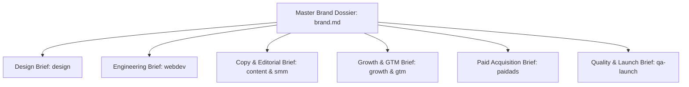
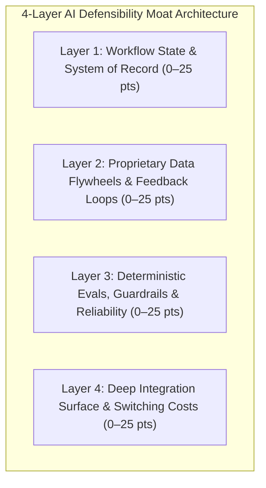

# brief — Master Cross-Department Synthesis Dossier

> **Operating Principle**: Raw client onboarding notes and sprawling questionnaires are useless to execution engineers and designers. The `brief` mode acts as the authoritative synthesizer, translating discovery data into crisp, highly structured departmental sub-briefs tailored specifically for `design`, `webdev`, `content`, `growth` & `gtm`, `paidads`, and `qa-launch`.

---

## The Master Brand Dossier Architecture

Upon completion of `intake`, `research`, and `accounts-access`, compile the client's durable source of truth to:
`.agents/context/brand.md`

From this master document, generate 6 specialized execution briefs:



---

## Technical Founder Intake & AI Defensibility Moat Audit

For Technical Founders, AI Startups, and Developer Tools (`developer_tools` and technical `b2b_saas`), generic agency intake questions fail to capture architectural defensibility. In addition to standard brand discovery, conduct the **4-Layer AI Defensibility Moat Audit** ("Beyond the Wrapper"):



### 1. The 4 Defensibility Layers:
1. **Layer 1: Workflow State & System of Record (0–25 pts)**:
   - Does the product own the canonical state of work (e.g. project graphs, transaction ledgers, active sessions)?
   - If the AI model was disabled, would users still keep the product open to view or manage state?
2. **Layer 2: Proprietary Data Flywheels & Feedback Loops (0–25 pts)**:
   - Does customer usage generate private domain data, correction telemetry, or edge-case evaluations?
   - Is there a compounding advantage where more usage directly produces higher agent or model accuracy?
3. **Layer 3: Deterministic Evals, Guardrails & Reliability (0–25 pts)**:
   - Are probabilistic LLM outputs gated by deterministic validations (AST parsers, compiler checks, type systems, test runners)?
   - Can the founder prove sub-1% hallucination rate through automated verification harnesses?
4. **Layer 4: Deep Integration Surface & Switching Costs (0–25 pts)**:
   - How deeply integrated is the product into developer toolchains (IDE plugins, CLI tools, CI/CD pipelines, git webhooks)?
   - What is the friction and organizational cost to rip out and replace?

### 2. Defensibility Moat Index (0–100 Scale):
| Score Range | Tier Classification | Strategic Diagnosis & Agency Mandate |
|:---|:---|:---|
| **0–40** | **Thin Wrapper (High Existential Risk)** | Vulnerable to upstream foundation model commoditization (e.g. OpenAI/Anthropic native releases). Agency mandate: Prioritize immediate engineering of workflow state capture and deterministic evals before scaling paid ads. |
| **41–70** | **Emerging Defensibility (Moderate)** | Defensible workflow with moderate switching costs. Agency mandate: Tighten telemetry loops, build IDE/CLI integrations, and articulate the concrete architectural moat in landing copy. |
| **71–100** | **Structural Moat (Model-Agnostic Resilient)** | Full compound advantage. Upstream foundation model upgrades accelerate this product rather than destroy it ("N+1 model tailwind"). Agency mandate: Scale developer community launch (Show HN, Reddit, GitHub), establish category authority, and push technical content. |

---

## Canonical Master Brand Dossier Schema (`.agents/context/brand.md`)

When synthesizing `.agents/context/brand.md`, the document must strictly structure and declare the following sections:

```markdown
# 🏷️ Master Brand Dossier — [Client Name]

## 1. Executive Summary & Core Invariants
- **Legal Entity**: [Company Name] ([Jurisdiction])
- **Industry Vertical**: developer_tools | b2b_saas | ecommerce_retail | professional_services | local_healthcare | creator_media
- **Target Page Archetype**: [Developer Homepage 7-block | SaaS 9-section | E-Commerce Showcase | Portfolio / Booking]
- **Defensibility Moat Index**: [0–100 Score] ([Thin Wrapper | Emerging Defensibility | Structural Moat])
- **Primary Value Proposition**: [Quantified, verified value proposition]
- **North Star 90-Day Metric**: [Target KPI]

## 2. ICP & Target Audience Profile
- **Primary Persona**: [Title, Technical Depth, Buying Role]
- **Core Friction / Pain Point**: [Authentic customer quote or frustration]
- **Alternative / Competitors Replaced**: [Direct and indirect alternatives]
- **Buying Triggers**: [What sparks immediate evaluation or purchase]

## 3. Brand Identity & Design Tokens (DTCG)
- **Aesthetic Archetype**: Minimalist Swiss-print | Dark Technical Ceramic | Bold High-Contrast Fintech | Warm Organic Editorial
- **Primary Palette**: OKLCH tokens (Primary, Secondary, Surface, Neutral, Border, Accent)
- **Typography Scale**: Display, Heading, Body, Code webfonts
- **Vector Assets**: Links to verified light/dark `.svg` assets

## 4. Technical Architecture & Engineering Constraints
- **Framework**: Next.js 14+ App Router | Astro v5+ | Hono | Instatic
- **Styling**: Tailwind CSS v4 | UnoCSS Wind 4 + BEM
- **Hosting & Edge**: Cloudflare Pages/Workers | Vercel | Supabase Postgres
- **Performance Budget**: p95 LCP <= 1.8s, CLS <= 0.05, First-load JS <= 120kB

## 5. Messaging, Voice & Approved Claims
- **Tone Vector**: Formality (1-10), Technical Density (1-10), Wit (1-10)
- **Approved Claims**: [Zero unverified claims; verified metrics with proof receipts]
- **Forbidden Vocabulary**: [Prohibited empty buzzwords: seamless, robust, game-changing, etc.]
- **SEO/AEO Focus**: [Primary search intent clusters, 18-token quotability target]
```

---

## Departmental Execution Sub-Briefs

From the Master Dossier, synthesize 6 isolated sub-briefs into `.agents/artifacts/brand/department-briefs.md`:

---

### Department Brief 1: For `design` (Visual Identity & Layouts)
- **Industry Vertical**: Declared vertical from master dossier (`developer_tools`, `b2b_saas`, etc.).
- **Primary Aesthetic Archetype**: Minimalist Swiss-print, Dark Technical Ceramic, Bold High-Contrast Fintech, or Warm Organic Editorial.
- **Vertical Template Selection**:
  - `developer_tools` $\rightarrow$ Jakub Czakon 7-block layout (`design/templates/developer.md`).
  - `b2b_saas` $\rightarrow$ 9-section SaaS conversion layout (`design/templates/saas.md`).
  - `ecommerce_retail` $\rightarrow$ Visual merchandising & product catalog showcase.
  - Non-technical verticals strictly forbidden from receiving terminal blocks or code grids.
- **Design Tokens (DTCG format)**:
  - Color Tokens: Primary, Secondary, Neutral, Surface, Border, Semantic Accent (HEX & OKLCH values).
  - Typography: Display, Heading, Body, Code font families and size scales.
  - Spatial Scale: 4px base grid with intra/inter spacing ratios.
- **Logo Assets**: Path to verified vector `.svg` assets in light/dark variants.

---

### Department Brief 2: For `webdev` (Technical Architecture)
- **Industry Vertical & Component Routing**:
  - `developer_tools`: `<DeveloperHero />`, `<InteractiveDemo />`, `<ArchitectureOverview />`, `<CodeFeatureGrid />`, `<DeveloperProofBar />`, `<QuickstartSection />`, `<PricingLicenseGrid />`.
  - `b2b_saas`: `<SaaSHero />`, `<LogoCloud />`, `<FeatureBento />`, `<MetricsGrid />`, `<TestimonialWall />`, `<PricingCalculator />`.
  - `ecommerce_retail`: `<ProductHero />`, `<VariantPicker />`, `<CartDrawer />`, `<ReviewStars />`.
- **Target Tech Stack**: Next.js App Router, Astro, or Hono; Tailwind CSS or UnoCSS Wind 4.
- **CMS & Data Stores**: Headless Payload, WordPress Bedrock, Supabase Postgres, or Redis.
- **Repository Topology**: GitHub repository URL, branch strategy (`dev` -> `main`), and PR conventions.
- **Deployment & Hosting**: Cloudflare Pages / Workers or Vercel, DNS routing, and custom domain setup.
- **Performance Budget**: p95 LCP $\le 1.8\text{s}$, CLS $\le 0.05$, bundle size $\le 120\text{kB}$ initial JS.

---

### Department Brief 3: For `content` & `smm` (Messaging & Copywriting)
- **Brand Voice Vector**: Formality score (1–10), Technical density (1–10), Humor/Wit allowance (1–10).
- **Approved Claims Library**: Verified ROI metrics, client case study figures, and customer testimonials (zero unverified claims).
- **Forbidden Vocabulary**: Banned buzzwords (e.g. *seamless*, *robust*, *cutting-edge*, *elevate*, *empower*, *next-gen*, *revolutionary*).
- **Copywriting Formula Selection**: Recommended page formulas from `content:copy` (e.g. AIDA, PAS, QUEST, ACCA, DOS, Belcher 21-Part).
- **SEO/AEO Directives**: Primary keyword clusters, 18-token standalone quotability rule, answer-first formatting, and Article/FAQ schema requirements.

---

### Department Brief 4: For `growth` & `gtm` (Developer Discovery & Defensibility Moat)
- **Defensibility Moat Index**: Score & Layer breakdown from the AI Moat Audit.
- **N+1 Model Resilience Narrative**: Clear positioning statement proving why the product gets *better*, not obsolete, as foundation models advance.
- **Target Developer Launch Channels**:
  - Hacker News: Show HN headline, founder first-comment structure, architecture diagram.
  - Technical Reddit: Subreddit targeting (e.g. `r/selfhosted`, `r/webdev`, `r/rust`), 9:1 value ratio, text-first post.
  - GitHub Discovery: Above-the-fold README ergonomics, quickstart snippet, topic tags.
- **Conversion Mechanisms**: Direct path to Time to First Value (TTFV $\le 5$ minutes via interactive playground, Docker one-liner, or CLI npx runner).

---

### Department Brief 5: For `paidads` (Paid Acquisition & Tracking)
- **Assigned Ad Accounts**: Meta Business Manager ID, Google Ads CID, TikTok Ads ID.
- **Tracking & Pixel Infrastructure**: GTM Container ID, GA4 Measurement ID, Meta Pixel/CAPI dataset.
- **Budget & Targets**: Monthly ad spend, target Cost Per Acquisition (CPA), target ROAS, target CPL.
- **Angle White Space**: Proven competitor angles from research vs differentiated brand hooks.

---

### Department Brief 6: For `qa-launch` (Quality Verification & Gates)
- **Device & Viewport Matrix**: Target mobile devices (iPhone 13/14/15, Samsung Galaxy S23), tablet (iPad), desktop (1366x768, 1920x1080).
- **Browser Matrix**: Chrome, Safari (macOS & iOS WebKit), Firefox, Edge.
- **Critical Path Workflows**: Sign-up flow, checkout/payment flow, contact/demo booking form.
- **Compliance Checks**: Privacy Policy, Terms of Service, Cookie banner (GDPR/CCPA), WCAG 2.2 AA accessibility pass.

---

## Deliverables

1. Master Brand Dossier: `.agents/context/brand.md`
2. Departmental Execution Briefs: `.agents/artifacts/brand/department-briefs.md`

---

## Quality Gate

- [ ] Master Brand Dossier synthesized and saved to `.agents/context/brand.md`.
- [ ] Industry Vertical explicitly declared and verified across all sub-briefs.
- [ ] For technical/AI products, 4-Layer Defensibility Moat Audit completed with Defensibility Moat Index score recorded.
- [ ] All 6 departmental sub-briefs contain complete, concrete specifications (no "TBD" placeholders).
- [ ] Voice vectors, forbidden words, and approved claims defined for content and social teams.
- [ ] Tech stack, repos, and performance budgets locked for engineering.
- [ ] Growth & GTM channel strategy and N+1 resilience narrative articulated.
- [ ] Tracking IDs and conversion goals verified for paid acquisition.
