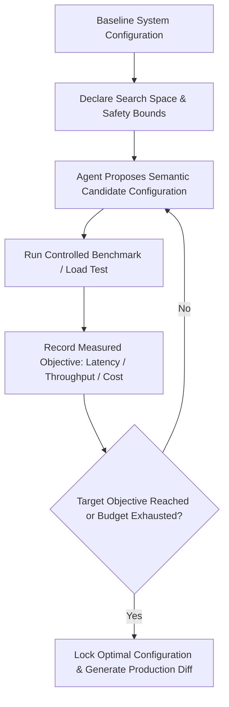

# tuning — Automated System Parameter Tuning & Benchmark Optimization

## Scope

- Iterative parameter optimization for database connection pools, cache TTLs, vector search quantization, and API worker concurrency.
- Semantic parameter reasoning: proposing candidates based on what each parameter means in context rather than blind numerical grid search.
- Closed-loop objective evaluation: measuring p95/p99 latency, memory consumption, throughput, and infrastructure cost.
- Fallback guardrails to prevent system crashes, memory exhaustion, or database connection starvation.

## Deliverable

A Parameter Optimization Log with baseline vs optimized benchmarks, convergence graphs, and production configuration diffs.

## The Semantic Optimization Loop



## Common Agency Optimization Targets

### 1. Database Connection Pooling (PostgreSQL / Supabase / Neon)
- **Parameters to Tune**:
  - `max_connections` (Pool upper limit).
  - `idle_timeout` (Connection reuse window).
  - `statement_timeout` (Slow query circuit breaker).
- **Objective**: Minimize connection queue time under concurrent load while avoiding database `too many clients` fatal errors.

### 2. Redis & Cache Invalidation TTLs
- **Parameters to Tune**:
  - `default_ttl` (Cache longevity).
  - `stale_while_revalidate` (Background refresh window).
  - `max_memory_policy` (`allkeys-lru` vs `volatile-lru`).
- **Objective**: Maximize Cache Hit Rate (>90%) without serving stale data past business tolerance.

### 3. Vector Search Indexing & Quantization (Qdrant / pgvector)
- **Parameters to Tune**:
  - `m` (Max connections per HNSW node: 16 to 64).
  - `ef_construct` (Index construction precision: 64 to 512).
  - Quantization Mode: `None` (Full float32) vs `Scalar` (int8, 4x memory compression) vs `Binary` (1-bit, 32x compression).
- **Objective**: Achieve sub-20ms search latency while maintaining cosine similarity recall above 95%.

### 4. Background Job Concurrency
- **Parameters to Tune**:
  - `worker_concurrency` (Parallel threads/processes).
  - `batch_size` (Items processed per database transaction).
- **Objective**: Maximize throughput without saturating CPU or triggering external API rate limits.

## Optimization Report Schema

```markdown
| Parameter | Baseline | Tested Range | Optimal Setting | Impact |
|:---|:---|:---|:---|:---|
| **DB Pool Size** | 10 | 5 – 50 | **25** | -38% p99 latency under 200 req/s |
| **HNSW ef_search** | 64 | 32 – 256 | **128** | +12% recall with +3ms latency |
| **Quantization** | Full (float32) | Float32 vs Int8 | **Scalar (Int8)** | 73% RAM reduction, 0.8% recall drop |
```

## Quality Gate

- [ ] Search space strictly bounded to prevent out-of-memory (OOM) crashes or process termination.
- [ ] Every trial verified with real load-test or benchmark commands (evidence before assertions).
- [ ] Production rollout accompanied by rollback configuration file.
- [ ] No manual hand-tuning when automated iterative trials can evaluate the parameter space.

## Routing

- Database schema migration and index design → `database` (index mode).
- Frontend Core Web Vitals and bundle size tuning → `webdev` / `perf`.
- Production deployment infrastructure → `devops`.
