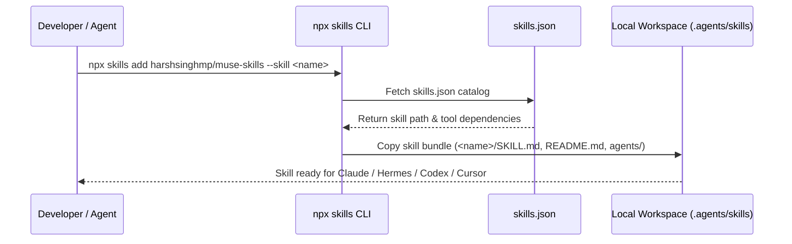
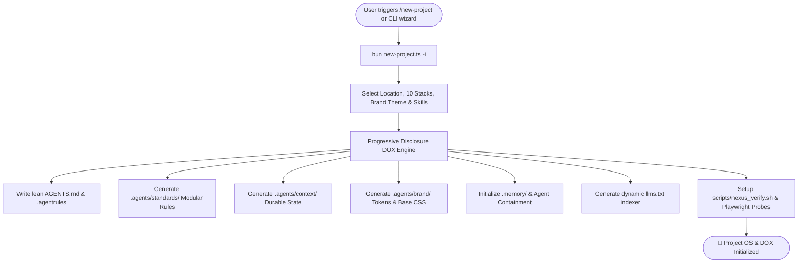
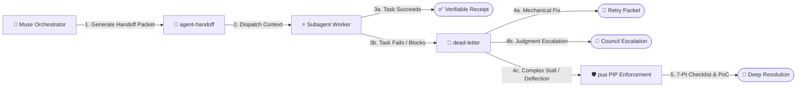

# Architecture & System Design

## Overview

**Muse Skills** (`@harsh/muse-skills`) is an enterprise-grade agent skill repository and governance toolkit within the **LifeOS** ecosystem. It provides autonomous AI agents with structured operational capabilities for Project Operating System provisioning, workspace memory synchronization, PIP performance enforcement, subagent coordination, error triage, and context anchoring.

All skills follow a dual-layer architecture:
1. **Universal Metadata Layer**: Extended YAML frontmatter (with Hermes metadata, tools, and platform requirements) parsed natively by `npx skills`, Claude Code, Cursor, and Hermes.
2. **Deterministic Markdown Execution Engine**: Standard RFC sections (`When to Use`, `Quick Reference`, `Procedure`, `Pitfalls`, `Verification`) ensuring zero-hallucination execution across all LLM models.

---

## Technical Stack

| Layer | Technology | Specification / Standard |
| :--- | :--- | :--- |
| **Package Runtime** | Node.js / Bun | ECMAScript Modules (`"type": "module"`) |
| **Skill Protocol** | RFC Agent Skills Standard | YAML Frontmatter + Markdown Body |
| **Metadata Engine** | Hermes Metadata Schema | `metadata.hermes` namespace with tags, dependencies, and tools |
| **CLI & Registry** | `npx skills` / `skills.sh` | Global repository discovery & tree installation |
| **Scaffolding Tooling** | TypeScript / Bun | Strict-mode project OS & DOX generation (`new-project.ts`) |
| **Validation Suite** | Bash & Node.js | Memory file assertion & JSON schema validation |
| **Version Control** | Git + Meaningful Commit Protocol | Semantic versioning (`v1.5.0`) with structured changelog |

---

## Directory Structure

```
muse-skills/
├── docs/                           # Canonical technical documentation
│   ├── ARCHITECTURE.md             # System architecture & data flow
│   ├── CHANGELOG.md                # Semantic version release log
│   └── SKILL_SPECIFICATION.md      # RFC skill authoring standard
│
├── new-project/                    # Project OS & governance scaffolder (Flagship #1)
│   ├── agents/openai.yaml          # Agent tool definition
│   ├── references/                 # Architecture reference docs
│   ├── scripts/new-project.ts      # Scaffolding engine
│   ├── README.md                   # Child documentation
│   └── SKILL.md                    # Core operational procedure
│
├── updateagents/                   # Workspace memory synchronization (Flagship #2)
│   ├── agents/openai.yaml          # Agent tool definition
│   ├── examples/before-after.md    # Synthesis examples
│   ├── references/                 # Priority tables & discovery commands
│   ├── scripts/validate-memory-file.sh # Memory file validator
│   ├── README.md                   # Child documentation
│   └── SKILL.md                    # Core operational procedure
│
├── pua/                            # PIP performance & structured debugging
│   ├── agents/openai.yaml          # Agent tool definition
│   ├── examples/sample-pip-report.md # Real-world diagnostic report
│   ├── README.md                   # Child documentation
│   └── SKILL.md                    # Core operational procedure
│
├── agent-handoff/                  # Structured subagent context packet generator
│   ├── agents/openai.yaml          # Agent tool definition
│   ├── examples/sample-handoff.md  # Packet example
│   ├── README.md                   # Child documentation
│   └── SKILL.md                    # Core operational procedure
│
├── context-anchor/                 # Working reference snapshot generator
│   ├── agents/openai.yaml          # Agent tool definition
│   ├── examples/sample-anchor.md   # Anchor example
│   ├── README.md                   # Child documentation
│   └── SKILL.md                    # Core operational procedure
│
├── dead-letter/                    # Failed/blocked task triage & capture
│   ├── agents/openai.yaml          # Agent tool definition
│   ├── examples/sample-dead-letter.md # Dead letter example
│   ├── README.md                   # Child documentation
│   └── SKILL.md                    # Core operational procedure
│
├── designscope/                    # Design system extraction from any visual source
│   ├── agents/openai.yaml          # Agent tool definition
│   ├── references/                 # Capture flows, analysis framework, templates
│   ├── scripts/                    # Stdlib-only validation & audit tools
│   ├── README.md                   # Child documentation
│   └── SKILL.md                    # Core operational procedure
│
├── code-review-linus-torvalds-style/ # Linus Torvalds style code review & quality enforcement
│   ├── agents/openai.yaml          # Agent tool definition
│   ├── examples/                   # Review verdict examples
│   ├── README.md                   # Child documentation
│   └── SKILL.md                    # Core operational procedure
│
├── refactor-ui/                    # Atomic UI design & interface refactoring engine
│   ├── agents/openai.yaml          # Agent tool definition
│   ├── references/                 # 10 Heuristic reference guides
│   ├── scripts/                    # WCAG contrast calculator & static UI auditor
│   ├── README.md                   # Child documentation
│   └── SKILL.md                    # Core operational procedure
│
├── gauntlet-loop/                  # Bounded multi-agent quality improvement loop
│   ├── agents/openai.yaml          # Agent tool definition
│   ├── examples/sample-gauntlet-run.md # Real-world gauntlet run
│   ├── references/gauntlet-protocol.md # Scoring rubric & stop rules
│   ├── README.md                   # Child documentation
│   └── SKILL.md                    # Core operational procedure
│
├── secretary-controller/           # Evidence-grounded staff-work controller & approval gate
│   ├── agents/openai.yaml          # Agent tool definition
│   ├── examples/sample-approval-packet.md # Hash approval packet
│   ├── references/staff-work-doctrine.md # Completed staff work doctrine
│   ├── README.md                   # Child documentation
│   └── SKILL.md                    # Core operational procedure
│
├── coupling-router/                # Coupling-aware architectural delegation router
│   ├── agents/openai.yaml          # Agent tool definition
│   ├── examples/sample-routing-decision.md # Task DAG plan
│   ├── references/coupling-matrix.md # Coupling calculation formula
│   ├── README.md                   # Child documentation
│   └── SKILL.md                    # Core operational procedure
│
├── evidence-ledger/                # Source-cited claim verification gate
│   ├── agents/openai.yaml          # Agent tool definition
│   ├── examples/sample-claim-ledger.md # Claim ledger table
│   ├── references/claim-verification-taxonomy.md # 4-tier confidence taxonomy
│   ├── README.md                   # Child documentation
│   └── SKILL.md                    # Core operational procedure
│
├── daily-standup-coach/            # Daily reflective check-in & effort scorecard
│   ├── agents/openai.yaml          # Agent tool definition
│   ├── examples/sample-standup-log.md # Daily log example
│   ├── references/effort-rubric.md # 5-pillar input rubric
│   ├── README.md                   # Child documentation
│   └── SKILL.md                    # Core operational procedure
│
├── periodic-retreat/               # Quarterly strategic retreat facilitator
│   ├── agents/openai.yaml          # Agent tool definition
│   ├── examples/sample-quarterly-review.md # Quarterly review artifact
│   ├── references/retreat-framework.md # 4 review scales
│   ├── README.md                   # Child documentation
│   └── SKILL.md                    # Core operational procedure
│
├── brain-audit/                    # Knowledge hygiene & referential integrity auditor
│   ├── agents/openai.yaml          # Agent tool definition
│   ├── examples/sample-audit-report.md # Hygiene report artifact
│   ├── references/hygiene-rules.md # Core referential rules
│   ├── README.md                   # Child documentation
│   └── SKILL.md                    # Core operational procedure
│
├── tests/                          # Automated TDD test suite
│   └── skills.test.ts              # Catalog, schema, and RFC assertions
│
├── CONTRIBUTING.md                 # Meaningful Git Commit Protocol
├── LICENSE                         # MIT License
├── llms.txt                        # Machine-readable LLM documentation index
├── package.json                    # Package metadata & keywords
├── README.md                       # Main repository overview
└── skills.json                     # Skill catalog registry
```

---

## Core Execution Flows

### Flow 1: Skill Discovery & Universal Ingestion



### Flow 2: Project OS & Progressive DOX Provisioning (`new-project`)



### Flow 3: Subagent Handoff & Failure Recovery (`agent-handoff` ➔ `dead-letter` ➔ `pua`)



---

## Configuration & Governance

1. **`skills.json`**: Primary catalog registry consumed by skill discovery engines. Requires `name`, `description`, `path`, `version`, `tools`, and `tags`.
2. **`package.json`**: Defines package metadata, validation scripts (`npm run validate`), and keyword tags.
3. **`CONTRIBUTING.md`**: Enforces the **Meaningful Git Commit Protocol** across all changes.
4. **Vibeguard Protocol**: Zero-credential exposure invariant applied across all scripts, documentation, and transcripts.
