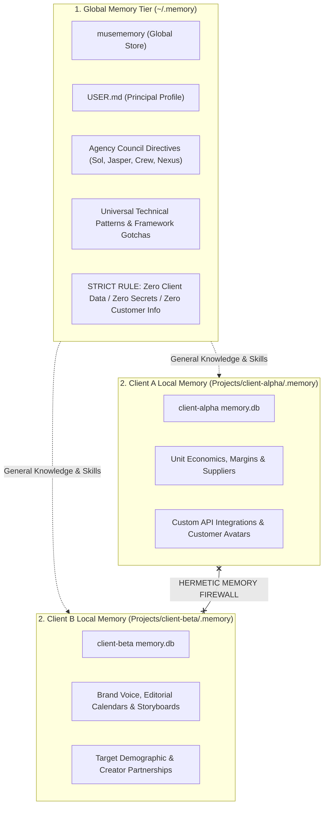

# multi-client — Multi-Client Portfolio & Sub-App Workspace Isolation

> **Operating Principle**: The agency operates across dozens of concurrent client brands, e-commerce stores, and technical SaaS products. Multi-client execution demands absolute, airtight isolation: one client's proprietary code, customers, credentials, unit economics, or memory must NEVER bleed into another client or shared agent context.

---

## 1. Enterprise Multi-Client & Sub-App Workspace Topology (Adaptive Multi-Service)

Engagements, ventures, and open-source packages are partitioned into three dedicated domains to prevent operational crosstalk:
- `~/Projects/clients/<client_brand>/`: Multi-client retainers, agency deliverables, and customer projects with strict multi-tenant firewalling.
- `~/Projects/products/<product_name>/`: Sovereign internal ventures, SaaS platforms, and digital applications.
- `~/Projects/oss/<repo_name>/`: Public open-source libraries, CLI harnesses, and universal tools.

### Workspace Layout (Full-Service Client Brand):
```
~/Projects/clients/<client_brand>/     <-- Client Root Workspace (scaffolded via new-project)
├── .memory/                          <-- Client-Wide Isolated Memory (Hermetic local SQLite/DB)
│   ├── CURRENT.md                    <-- Active client hard constraints & in-flight tasks
│   └── memory.db                     <-- Local client cognitive memory store
├── .agents/                          <-- Unified DOX Context & Brand Container
│   ├── brand/                        <-- Design tokens, voice.md, personas.md, positioning.md
│   └── context/                      <-- product.md, accounts.md (Zero-Leak Registry), architecture.md
├── AGENTS.md                         <-- Client Root Router & Progressive Disclosure Rules
├── apps/                             <-- Sub-Applications & Engineering (Optional: apps/web, apps/shop)
│   └── web/                          <-- Primary Web Application / Storefront
├── creative/                         <-- (If Graphics/Design) tokens, decks, SVG vectors
└── marketing/                        <-- (If Growth/Marketing) smm calendars, SEO clusters, ad copy
```

### The 6 Adaptive Project Archetypes

| Archetype | Primary Focus | Hosting & DevOps | Core Output Assets | Primary Lead |
| :--- | :--- | :--- | :--- | :--- |
| **`static-edge`** | Fast marketing sites, blogs, portfolios, docs | Cloudflare Pages, GitHub Pages | Astro / Plain HTML, BEM, fluid OKLCH tokens | **Sol** |
| **`saas-fullstack`** | Authenticated SaaS, web apps, portals | Docker, VPS, Coolify, Fly.io, Vercel | Next.js, Postgres/Neon, Drizzle, Better Auth | **Sol** & **Nexus** |
| **`ecom`** | Headless & hosted e-commerce storefronts | Cloudflare Edge / Docker | Medusa v2, Stripe checkout, product catalogs | **Sol** & **Jasper** |
| **`graphics`** | Brand identity, design systems, visual assets | None / Static styleguide | W3C tokens, Figma handoff, decks, SVG vectors | **Jasper** |
| **`oss-library`** | Public tools, CLI packages, universal engines | GitHub Releases / npm / bun | TypeScript library, GitHub Actions CI, MIT license | **Sol** & **Nexus** |
| **`growth-retainer`** | SMM, SEO keyword clusters, paid advertising | None / Platform APIs | Content calendars, viral hooks, ad variations | **Jasper** & **Crew** |

---

## 2. Two-Tier Memory Isolation Standard



### A. Global Memory Tier (`~/.memory/` — `musememory`)
- Owned by `musememory`.
- Stores universal technical solutions (e.g. *"In Astro v5 with UnoCSS Wind 4, use this preset config"*, *"Bun test snapshot flags"*).
- Stores the Principal's high-level profile, global constraints, and Council leadership models.
- **Redaction Gate**: Zero client-specific entities, proprietary business logic, domains, or credentials ever enter global memory.

### B. Client Local Memory Tier (`<client-root>/.memory/`)
- Initialized automatically via `new-project` / `memory init`.
- Contains all client-specific business knowledge, pricing models, ICP pain points, customer feedback, and internal architecture decisions.
- **Hermetic Containment**: All sub-apps within the client brand (`apps/web`, `apps/shop`, `apps/academy`) share the client's root `.memory/`, ensuring unified brand intelligence while remaining 100% firewalled from other client projects.

---

## 3. Sub-App Routing Table & Domain Mapping

In `.agents/context/product.md`, the client project defines the **Sub-App Topology Table**. Downstream agents (`secretary:dispatch`, `webdev`, `design`, `devops`) inspect this table to automatically resolve execution directories, frameworks, and ports:

| Sub-App / Folder | Domain / Subdomain | Primary Role | Tech Stack | Root Dir | Dev Port |
|:---|:---|:---|:---|:---|:---|
| `apps/web/` | `client.com` | Public Marketing & Landing | Astro + Tailwind | `apps/web/` | `3000` |
| `apps/shop/` | `shop.client.com` | E-Commerce Storefront | Next.js + Medusa | `apps/shop/` | `3001` |
| `apps/academy/` | `learn.client.com` | Student LMS & Courses | Next.js + Payload | `apps/academy/` | `3002` |

### Autonomous Sub-App Anchoring:
1. When user prompts mention "store", "cart", or "checkout", `secretary:dispatch` resolves `apps/shop/`, switches CWD, and enforces that sub-app's rules.
2. When user prompts mention "landing hero", "marketing", or "blog", `secretary:dispatch` resolves `apps/web/`.
3. When user prompts mention "lesson", "course quiz", or "student portal", `secretary:dispatch` resolves `apps/academy/`.

---

## 4. Sub-App Secret Isolation Standard

- **Prohibition**: Never pool client credentials into a single monolithic `.env` at the root.
- **Partitioning**:
  - `apps/web/.env`: Only contains public client variables (`PUBLIC_SITE_URL`, `PUBLIC_GA4_ID`).
  - `apps/shop/.env`: Contains commerce credentials (`MEDUSA_BACKEND_URL`, `STRIPE_PUBLISHABLE_KEY`).
  - `apps/academy/.env`: Contains LMS database connection strings (`DATABASE_URL`, `PAYLOAD_SECRET`).
- Running `bun run secret-scan` verifies that backend database keys never leak into the static public frontend.

---

## 5. The 5-Checkpoint Cross-Client Context Firewall

Before an agent switches between client workspaces or executes tasks, it must enforce the **5-Checkpoint Firewall**:

| Checkpoint | Check Name | Verification Rule |
|:---|:---|:---|
| **Check 1** | **Workspace Boundary Check** | CWD and all read/write file tools strictly constrained within `~/Projects/<client_brand>/`. No referencing sibling client folders. |
| **Check 2** | **Secret & Key Partitioning** | API keys, ad account IDs (Meta CID, Google MCC), and database URLs are partitioned strictly per client; never shared in global configs. |
| **Check 3** | **Memory Namespace Isolation** | All `memory_capture` and retrieval operations bind to the client's local `.memory/`. Global memory queries are strictly filtered for generic concepts. |
| **Check 4** | **White-Label Deliverable Sanitization** | Shipped client deliverables (code, design tokens, copy, PRs) must NEVER contain internal agency identifiers, peer client names, or cross-client artifacts. |
| **Check 5** | **Context Switch Protocol** | When switching between clients, agent must wipe working memory and record a mandatory **5-line audit log**: |

### The 5-Line Context Switch Audit Log:
```markdown
1. Prior Engagement Handover: [Client A ID] closed at [Commit SHA / Milestone State].
2. Modified Files: [List of files touched in Client A].
3. Captured Invariants: [Key client decisions synced to Client A's .memory/CURRENT.md].
4. Open Loops & Risks: [Unsettled tasks or blockers left in Client A].
5. Target Scope Switch: Context cleared. Anchored to [Client B ID] at [Client B CWD].
```

---

## 6. Portfolio Capacity Planning & Little's Law

1. **Capacity Tracking**: Size capacity before selling more work:
   $$\text{Utilization} = \frac{\text{Committed Booked Hours (Delivery + Retainer + Admin)}}{\text{Available Hours per Period}}$$
   Flag any client slot over $\ge 85\%$ as overbooked with a named rebalance before it causes late delivery.
2. **Little's Law Estimator**:
   $$\text{Cycle Time} = \frac{\text{WIP}}{\text{Throughput}}$$
   Turns a blocked milestone into an empirical calendar date, not a subjective guess.
3. **Dynamic Re-sequencing**: When a new engagement lands, re-compute utilization, reschedule the lowest-priority-at-risk milestone first, and notify the affected client before the deadline passes.

---

## 7. Quality Gate

- [ ] Per-client workspaces strictly isolated under `~/Projects/<client_brand>/`; zero cross-client file bleed.
- [ ] Local `.memory/` store exists at client root with active `CURRENT.md`.
- [ ] Global memory anchored at `~/.memory` via `musememory` with zero client data or secrets.
- [ ] Sub-app topology table defined in `.agents/context/product.md` with explicit domain and dev port mapping.
- [ ] Sub-apps maintain isolated `.env` configurations; zero backend database keys leaked to static frontends.
- [ ] The 5-Checkpoint Cross-Client Context Firewall enforced on every engagement switch with a 5-line log.
- [ ] Utilization ratio computed per period; $>85\%$ slots flagged and rebalanced.
- [ ] Secret scan passes clean (`bun run secret-scan`).
